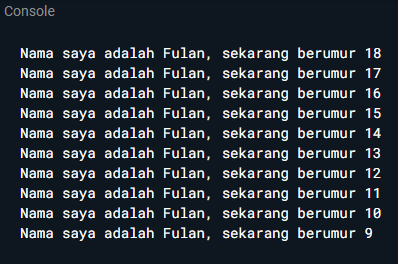

# **Tugas Pratikum Mobile Week 2**

---

## **1. Modifikasilah kode pada baris 3 di VS Code atau Editor Code favorit Anda berikut ini agar mendapatkan keluaran (output) sesuai yang diminta!Output yang diminta (Gantilah Fulan dengan nama Anda):**

 
 

### **Hasil Modifikasi Kode**

### **Output Kode**

## **2. Mengapa sangat penting untuk memahami bahasa pemrograman Dart sebelum kita menggunakan framework Flutter ? Jelaskan!**

Flutter dibangun menggunakan bahasa pemrograman Dart, sehingga semua kode program Flutter ditulis dalam Dart.Tanpa pemahaman Dart, proses belajar Flutter akan terasa sulit karena tidak paham syntax dan konsep dasar pemrograman yang dipakai. Jadi, Dart adalah pondasi sebelum membangun aplikasi dengan Flutter.

## **3. Rangkumlah materi dari codelab ini menjadi poin-poin penting yang dapat Anda gunakan untuk membantu proses pengembangan aplikasi mobile menggunakan framework Flutter.**

- Program Dart mulai dari `main()`
- Control Flow Mendukung `if`, `for`, `while`, `do-while`, dan `switch`.
- Fungsi Bisa ditulis dengan cara biasa atau arrow function. 
  `int tambah(int a, int b) => a + b;`
- Variabel dapat dideklarasikan dengan `var`, `dynamic`, atau tipe data spesifik (`int`, `double`, `String`, `bool`).Dart mendukung type inference (menebak tipe data otomatis).
- null safety : Variabel default tidak bisa null.Kalau mau null → tambahkan ?. 
  `String? nama;`
  -Late Variable: Nilai ditunda, tapi wajib diisi sebelum dipakai. 
  `late String alamat;`

## **4. Buatlah penjelasan dan contoh eksekusi kode tentang perbedaan Null Safety dan Late variabel!**

1. Null Safety

- Tujuan: mencegah error saat variabel bernilai null.
- Default: variabel tidak boleh null.
- Kalau ingin variabel bisa null, tambahkan tanda ? setelah tipe data.

2. Late Variable

- Tujuan: menunda inisialisasi variabel sampai dipakai.
- Cocok kalau nilai variabel baru tersedia nanti (misalnya dari API atau input user).
- Kalau digunakan sebelum diberi nilai → akan error.

Jadi:

- Gunakan Null Safety kalau variabel memang boleh kosong/null.

- Gunakan Late Variable kalau variabel pasti punya nilai, tapi nilainya baru bisa diisi nanti.

### **Contoh Eksekusi**

 

