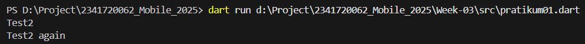
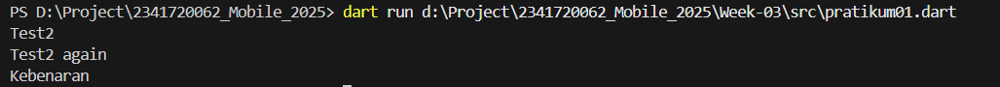
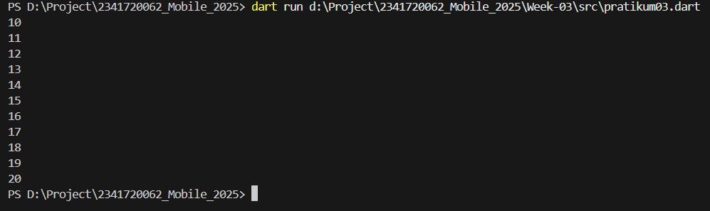

# **Tugas Pratikum Mobile Week 3**

---

## **1. Praktikum 1: Menerapkan Control Flows ("if/else")**

### **Langkah 1 & 2**

- Kode Program

```
void main() {
  String test = "test2";
  if (test == "test1") {
    print("Test1");
  } else if (test == "test2") {
    print("Test2");
  } else {
    print("Something else");
  }

  if (test == "test2") print("Test2 again");

  String test2 =
      "true"; // menggunakan nama variabel berbeda agar tidak redeclare
  if (test2 == "true") {
    print("Kebenaran");
  } else {
    print("Bukan kebenaran");
  }
}
```

> Masalahnya

- Penulisan If dan Else harus huruf kecil (if, else). Dart case-sensitive.
- Setelah diperbaiki menjadi else if dan else, kode bisa jalan.



> Penjelasan

- test == "test1" → false.
- test == "test2" → true → cetak "Test2".
- Baris kedua if (test == "test2") juga true → cetak "Test2 again".

### **Langkah 3**



> Masalah

- Muncul error "Error: A value of type 'String' can't be used as a condition."
- Karena di Dart, kondisi if hanya boleh berupa bool, bukan String.
  > Penjelasan
- test == "true" menghasilkan boolean true.

- Karena kondisi benar, maka "Kebenaran" ditampilkan.

## **2. Praktikum 2: Menerapkan Perulangan "while" dan "do-while"**

### **Langkah 2**

> Kode Program

```

void main() {
int counter = 0; //inisialisasi counter
while (counter < 33) {
print(counter);
counter++;
}

do {
print(counter);
counter++;
} while (counter < 77);
}

```

> Error

- terjadi error "Error: Undefined name 'counter'" karena variabel counter belum dideklarasi sebelumnya.
  > Penjesalan :
- int counter = 0; → variabel penghitung dimulai dari 0.

- while (counter < 33) → perulangan terus berjalan selama counter kurang dari 33.

- counter++ → menambah nilai counter setiap iterasi, supaya perulangan tidak infinite loop
- Program berhenti setelah mencetak angka 32 karena saat counter menjadi 33, kondisi counter < 33 sudah false.

### **Langkah 3**

> Output langkah 1 dan 3

```
PS D:\Project\2341720062_Mobile_2025> dart run d:\Project\2341720062_Mobile_2025\Week-03\src\pratikum02.dart
0
1
2
3
4
5
6
7
8
9
10
11
12
13
14
15
16
17
18
19
20
21
22
23
24
25
26
27
28
29
30
31
32
33
34
35
36
37
38
39
40
41
42
43
44
45
46
47
48
49
50
51
52
53
54
55
56
57
58
59
60
61
62
63
64
65
66
67
68
69
70
71
72
73
74
75
76
PS D:\Project\2341720062_Mobile_2025>

```

> Penjelasan

- While loop → Mengecek kondisi dulu (counter < 33), lalu mencetak angka.

- Output: 0 … 32.

- Do-while loop → Menjalankan isi loop dulu, baru cek kondisi.

- Saat counter sudah 33, do tetap jalan → mencetak 33 … 76.

## **3. Praktikum 3: Menerapkan Perulangan "for" dan "break-continue"**

- kode program

```

void main() {
for (int index = 10; index < 27; index++) {
if (index == 21)
break;
else if (index > 1 && index < 7)
continue;
print(index);
}
}

```

### Langkah 1 & 2

> Masalahnya

- Variabel Index tidak dideklarasikan. Harus ada int index = 10;.

- Penulisan Index vs index tidak konsisten → Dart peka terhadap huruf besar/kecil (case sensitive).

- Di bagian for, harus ada index++ (increment).

> Hasil Eksekusi
> Program akan mencetak angka 10 sampai 26.

### Langkah 3

> Masalahnya

- If dan Else If harus ditulis kecil → if, else if.

- Variabel harus konsisten (index, bukan Index).

- Kondisi index > 1 || index < 7 selalu true untuk semua angka, karena setiap angka pasti lebih besar dari 1 atau lebih kecil dari 7 → jadi continue selalu jalan. Mungkin maksudnya && (dan).

- print(index); akan terlewati jika continue jalan, jadi perlu penempatan hati-hati.

  > Hasil Eksekusi

  

- Program akan mencetak angka 10 sampai 20.

- Ketika index == 21, loop berhenti (break).

- Kondisi index > 1 && index < 7 tidak pernah terpenuhi (karena index mulai dari 10), jadi continue tidak berpengaruh di contoh ini.

## **4. Tugas Praktikum**

- Buatlah sebuah program yang dapat menampilkan bilangan prima dari angka 0 sampai 201 menggunakan Dart. Ketika bilangan prima ditemukan, maka tampilkan nama lengkap dan NIM Anda.

### Kode Program

```
void main() {
  String nama = "Taufik Dimas Edystara";
  String nim = "2341720062";

  for (int i = 0; i <= 201; i++) {
    if (isPrima(i)) {
      print("$i -> $nama | NIM: $nim");
    }
  }
}

bool isPrima(int n) {
  if (n < 2) return false;
  for (int i = 2; i <= n ~/ 2; i++) {
    if (n % i == 0) {
      return false;
    }
  }
  return true;
}
```

### Penjelasan

- for (int i = 0; i <= 201; i++) → looping dari 0 sampai 201.

- isPrima(i) → fungsi untuk cek apakah i bilangan prima.

- Jika prima → print bilangan tersebut + nama + NIM.

- Fungsi isPrima mengecek pembagi dari 2 sampai n ~/ 2 (pembagian integer).

### Output

```
PS D:\Project\2341720062_Mobile_2025> dart run d:\Project\2341720062_Mobile_2025\Week-03\src\bilanganPrima.dart
2 -> Taufik Dimas Edystara | NIM: 2341720062
3 -> Taufik Dimas Edystara | NIM: 2341720062
5 -> Taufik Dimas Edystara | NIM: 2341720062
7 -> Taufik Dimas Edystara | NIM: 2341720062
11 -> Taufik Dimas Edystara | NIM: 2341720062
13 -> Taufik Dimas Edystara | NIM: 2341720062
17 -> Taufik Dimas Edystara | NIM: 2341720062
19 -> Taufik Dimas Edystara | NIM: 2341720062
23 -> Taufik Dimas Edystara | NIM: 2341720062
29 -> Taufik Dimas Edystara | NIM: 2341720062
31 -> Taufik Dimas Edystara | NIM: 2341720062
37 -> Taufik Dimas Edystara | NIM: 2341720062
41 -> Taufik Dimas Edystara | NIM: 2341720062
43 -> Taufik Dimas Edystara | NIM: 2341720062
47 -> Taufik Dimas Edystara | NIM: 2341720062
53 -> Taufik Dimas Edystara | NIM: 2341720062
59 -> Taufik Dimas Edystara | NIM: 2341720062
61 -> Taufik Dimas Edystara | NIM: 2341720062
67 -> Taufik Dimas Edystara | NIM: 2341720062
71 -> Taufik Dimas Edystara | NIM: 2341720062
73 -> Taufik Dimas Edystara | NIM: 2341720062
79 -> Taufik Dimas Edystara | NIM: 2341720062
83 -> Taufik Dimas Edystara | NIM: 2341720062
89 -> Taufik Dimas Edystara | NIM: 2341720062
97 -> Taufik Dimas Edystara | NIM: 2341720062
101 -> Taufik Dimas Edystara | NIM: 2341720062
103 -> Taufik Dimas Edystara | NIM: 2341720062
107 -> Taufik Dimas Edystara | NIM: 2341720062
109 -> Taufik Dimas Edystara | NIM: 2341720062
113 -> Taufik Dimas Edystara | NIM: 2341720062
127 -> Taufik Dimas Edystara | NIM: 2341720062
131 -> Taufik Dimas Edystara | NIM: 2341720062
137 -> Taufik Dimas Edystara | NIM: 2341720062
139 -> Taufik Dimas Edystara | NIM: 2341720062
149 -> Taufik Dimas Edystara | NIM: 2341720062
151 -> Taufik Dimas Edystara | NIM: 2341720062
157 -> Taufik Dimas Edystara | NIM: 2341720062
163 -> Taufik Dimas Edystara | NIM: 2341720062
167 -> Taufik Dimas Edystara | NIM: 2341720062
173 -> Taufik Dimas Edystara | NIM: 2341720062
179 -> Taufik Dimas Edystara | NIM: 2341720062
181 -> Taufik Dimas Edystara | NIM: 2341720062
191 -> Taufik Dimas Edystara | NIM: 2341720062
193 -> Taufik Dimas Edystara | NIM: 2341720062
197 -> Taufik Dimas Edystara | NIM: 2341720062
199 -> Taufik Dimas Edystara | NIM: 2341720062
167 -> Taufik Dimas Edystara | NIM: 2341720062
173 -> Taufik Dimas Edystara | NIM: 2341720062
179 -> Taufik Dimas Edystara | NIM: 2341720062
181 -> Taufik Dimas Edystara | NIM: 2341720062
191 -> Taufik Dimas Edystara | NIM: 2341720062
193 -> Taufik Dimas Edystara | NIM: 2341720062
167 -> Taufik Dimas Edystara | NIM: 2341720062
173 -> Taufik Dimas Edystara | NIM: 2341720062
179 -> Taufik Dimas Edystara | NIM: 2341720062
181 -> Taufik Dimas Edystara | NIM: 2341720062
191 -> Taufik Dimas Edystara | NIM: 2341720062
167 -> Taufik Dimas Edystara | NIM: 2341720062
173 -> Taufik Dimas Edystara | NIM: 2341720062
179 -> Taufik Dimas Edystara | NIM: 2341720062
181 -> Taufik Dimas Edystara | NIM: 2341720062
167 -> Taufik Dimas Edystara | NIM: 2341720062
173 -> Taufik Dimas Edystara | NIM: 2341720062
179 -> Taufik Dimas Edystara | NIM: 2341720062
167 -> Taufik Dimas Edystara | NIM: 2341720062
173 -> Taufik Dimas Edystara | NIM: 2341720062
167 -> Taufik Dimas Edystara | NIM: 2341720062
173 -> Taufik Dimas Edystara | NIM: 2341720062
179 -> Taufik Dimas Edystara | NIM: 2341720062
181 -> Taufik Dimas Edystara | NIM: 2341720062
191 -> Taufik Dimas Edystara | NIM: 2341720062
167 -> Taufik Dimas Edystara | NIM: 2341720062
173 -> Taufik Dimas Edystara | NIM: 2341720062
179 -> Taufik Dimas Edystara | NIM: 2341720062
167 -> Taufik Dimas Edystara | NIM: 2341720062
173 -> Taufik Dimas Edystara | NIM: 2341720062
167 -> Taufik Dimas Edystara | NIM: 2341720062
173 -> Taufik Dimas Edystara | NIM: 2341720062
179 -> Taufik Dimas Edystara | NIM: 2341720062
167 -> Taufik Dimas Edystara | NIM: 2341720062
173 -> Taufik Dimas Edystara | NIM: 2341720062
179 -> Taufik Dimas Edystara | NIM: 2341720062
181 -> Taufik Dimas Edystara | NIM: 2341720062
167 -> Taufik Dimas Edystara | NIM: 2341720062
173 -> Taufik Dimas Edystara | NIM: 2341720062
179 -> Taufik Dimas Edystara | NIM: 2341720062
167 -> Taufik Dimas Edystara | NIM: 2341720062
173 -> Taufik Dimas Edystara | NIM: 2341720062
179 -> Taufik Dimas Edystara | NIM: 2341720062
167 -> Taufik Dimas Edystara | NIM: 2341720062
173 -> Taufik Dimas Edystara | NIM: 2341720062
167 -> Taufik Dimas Edystara | NIM: 2341720062
173 -> Taufik Dimas Edystara | NIM: 2341720062
179 -> Taufik Dimas Edystara | NIM: 2341720062
181 -> Taufik Dimas Edystara | NIM: 2341720062
167 -> Taufik Dimas Edystara | NIM: 2341720062
173 -> Taufik Dimas Edystara | NIM: 2341720062
179 -> Taufik Dimas Edystara | NIM: 2341720062
167 -> Taufik Dimas Edystara | NIM: 2341720062
173 -> Taufik Dimas Edystara | NIM: 2341720062
179 -> Taufik Dimas Edystara | NIM: 2341720062
167 -> Taufik Dimas Edystara | NIM: 2341720062
173 -> Taufik Dimas Edystara | NIM: 2341720062
167 -> Taufik Dimas Edystara | NIM: 2341720062
167 -> Taufik Dimas Edystara | NIM: 2341720062
173 -> Taufik Dimas Edystara | NIM: 2341720062
167 -> Taufik Dimas Edystara | NIM: 2341720062
173 -> Taufik Dimas Edystara | NIM: 2341720062
179 -> Taufik Dimas Edystara | NIM: 2341720062
181 -> Taufik Dimas Edystara | NIM: 2341720062
167 -> Taufik Dimas Edystara | NIM: 2341720062
173 -> Taufik Dimas Edystara | NIM: 2341720062
179 -> Taufik Dimas Edystara | NIM: 2341720062
181 -> Taufik Dimas Edystara | NIM: 2341720062
179 -> Taufik Dimas Edystara | NIM: 2341720062
181 -> Taufik Dimas Edystara | NIM: 2341720062
191 -> Taufik Dimas Edystara | NIM: 2341720062
181 -> Taufik Dimas Edystara | NIM: 2341720062
191 -> Taufik Dimas Edystara | NIM: 2341720062
191 -> Taufik Dimas Edystara | NIM: 2341720062
193 -> Taufik Dimas Edystara | NIM: 2341720062
197 -> Taufik Dimas Edystara | NIM: 2341720062
197 -> Taufik Dimas Edystara | NIM: 2341720062
199 -> Taufik Dimas Edystara | NIM: 2341720062
PS D:\Project\2341720062_Mobile_2025>
```
