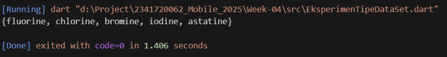

# **Tugas Pratikum Mobile Week 4**

---

## **Praktikum 1: Eksperimen Tipe Data List**

### **Langkah 1 & 2**

> Kode Program

```
void main() {
  var list = [1, 2, 3];
  assert(list.length == 3);
  assert(list[1] == 2);
  print(list.length);
  print(list[1]);

  list[1] = 1;
  assert(list[1] == 1);
  print(list[1]);
}
```

> Output


> Hasil Running

- Karena semua assert terpenuhi, program berjalan normal tanpa error.

### **Langkah 3**

> Kode Program

```
void main() {
  final List<dynamic> list = List.filled(5, null, growable: false);

  list[1] = 'Taufik Dimas Edystara';
  list[2] = '2341720062';

  print(list);
  print("Index 1: ${list[1]}");
  print("Index 2: ${list[2]}");
}
```

> Output


## **Praktikum 2: Eksperimen Tipe Data Set**

### **Langkah 1 & 2**

> Kode Program

```
void main() {
  var halogens = {'fluorine', 'chlorine', 'bromine', 'iodine', 'astatine'};
  print(halogens);
}
```

> Output



### **Langkah 3**

> Kode Program

```
//Pratikum 2 : Langkah 1
void main() {
  var halogens = {'fluorine', 'chlorine', 'bromine', 'iodine', 'astatine'};
  print(halogens);

  //Pratikum 2 : Langkah 2
  var names1 = <String>{};
  Set<String> names2 = {};
  var names3 = {};

  print(names1);
  print(names2);
  print(names3);
}
```

> Output


### **Modifikasi Lngkah 3**

> Kode Program

```
  names1.add('Taufik Dimas Edystara');
  names1.add('2341720062');
  names2.addAll({'Taufik Dimas Edystara', '2341720062 '});
```

> Output
> 

## **Praktikum 3: Eksperimen Tipe Data Maps**

### **Langkah 1 & 2**

> Kode Program

```
//Pratikum 3 : langkah 1
  var gifts = {'first': 'partridge', 'second': 'turtledoves', 'fifth': 1};
  var nobleGases = {2: 'helium', 10: 'neon', 18: 2};

  print(gifts);
  print(nobleGases);
```

> Output


### **Langkah 3**

> Kode Program

```
// Praktikum 3 : Langkah 3
  var mhs1 = <String, String>{};
  mhs1['first'] = 'partridge';
  mhs1['second'] = 'turtledoves';
  mhs1['fifth'] = 'golden rings';

  var mhs2 = <int, String>{};
  mhs2[2] = 'helium';
  mhs2[10] = 'neon';
  mhs2[18] = 'argon';

  print(mhs1);
  print(mhs2);
```

> Output


### **Modifikasi Langkah 3**

> Kode Program

```
/ Modifikasi Langkah 3 Pratikum 3
void main() {
  var gifts = {'first': 'partridge', 'second': 'turtledoves', 'fifth': 1};

  var nobleGases = {2: 'helium', 10: 'neon', 18: 2};

  var mhs1 = Map<String, String>();
  var mhs2 = Map<int, String>();

  gifts['first'] = 'partridge';
  gifts['second'] = 'turtledoves';
  gifts['fifth'] = 'golden rings';

  nobleGases[2] = 'helium';
  nobleGases[10] = 'neon';
  nobleGases[18] = 'argon';

  // Tambahkan Nama & NIM
  gifts['nama'] = 'Taufik Dimas Edystara';
  gifts['nim'] = '123456789';

  nobleGases[99] = 'Taufik Dimas Edystara';
  nobleGases[100] = '2341720062';

  mhs1['nama'] = 'Taufik Dimas Edystara';
  mhs1['nim'] = '2341720062';

  mhs2[1] = 'Taufik Dimas Edystara';
  mhs2[2] = '2341720062';

  print(gifts);
  print(nobleGases);
  print(mhs1);
  print(mhs2);
}
```

> Output
> 

## **Praktikum 4: Eksperimen Tipe Data List: Spread dan Control-flow Operators**

### **Langkah 1 & 2**

> Kode Program

```

main() {
var list = [1, 2, 3];
var list2 = [0, ...list];
print(list);
print(list2);
print(list2.length);
}

```

> Output


> Error

- Error terjadi karena variabel list1 tidak ada dalam kode. Seharusnya yang dicetak adalah list, bukan list1.sehingga akan muncul error: Undefined name 'list1'.

> Output setelah Diperbaiki
> 

### **Langkah 3**

> Kode Program

```

//Pratikum 4 : langkah 3
list1 = [1, 2, null];
print(list1);
var list3 = [0, ...?list1];
print(list3.length);

```

> Output


> Error

- ...?list1 artinya: jika list1 null, tidak akan terjadi error; isi list1 akan diabaikan. Jika ada elemen null di dalam list, itu tetap disalin apa adanya.

> Output Setelah Di perbaiki


### **Modifikasi Langkah 3**

> Kode Program

```
//modifikasi NIM
var nim = ['2', '3', '4', '1', '7', '2', '0', '0', '6', '2'];
var spreadNim = [...nim];
print('NIM dengan spread: $spreadNim');
print('NIM dengan join: ${nim.join()}');

```

> Output


### **Langkah 4**

> Kode Program

```
  //Pratikum 4 : langkah 4
  void main() {
    bool promoActive = true;
    var nav = ['Home', 'Furniture', 'Plants', if (promoActive) 'Outlet'];
    print(nav);

    promoActive = false;
    var nav2 = ['Home', 'Furniture', 'Plants', if (promoActive) 'Outlet'];
    print(nav2)
```

> Output


> Error

- error karena Variabel promoActive belum didefinisikan.

> Output Solved


### **Langkah 5**

> Kode Program

```
//Praktikum 4 : langkah 5
 //Praktikum 4 : langkah 5
  void printNavigation(String login) {
    var nav = [
      'Home',
      'Furniture',
      'Plants',
      if (login == 'Manager') 'Inventory',
    ];
    print('Login $login : $nav');
  }

  printNavigation('Manager');
  printNavigation('NPC');
```

> Output


> Error

- login belum didefinisikan. Sintaks if (login case `Manager`) salah. Dart menggunakan pola if (login == `Manager`).

> Output Solved


### **Langkah 6**

> Kode Program

```
 //Praktikum 4 : langkah 6
  var listOfInts = [1, 2, 3];
  var listOfStrings = ['#0', for (var i in listOfInts) '#$i'];
  assert(listOfStrings[1] == '#1');
  print(listOfStrings);
```

> Output


> - Collection-for memungkinkan membuat list baru dengan perulangan langsung di dalam literal list.

## **Praktikum 5: Eksperimen Tipe Data Records**

### **Langkah 1 & 2**

> Kode Program

```
  //Praktikum 5 : langkah 1
  var record = ('first', a: 2, b: true, 'last');
  print(record);
```

> Output


> Error

- Error karena titikkoma (;) pada print(record) tidak ada.

> Output Fix


### **Langkah 3**

> Kode Program

```
  //Praktikum 5 : langkah 3
  var angka = (10, 20);
  print('Sebelum tukar: $angka');
  var hasil = tukar(angka);
  print('Sesudah tukar: $hasil');
}
(int, int) tukar((int, int) record) { //ini diluar main
  var (a, b) = record;
  return (b, a);
}

```

> Output


> Penjelasan

- Fungsi tukar menukar urutan field dalam record (int,int).

### **Langkah 4**

> Kode program

```
  (String, int) mahasiswa = ('Taufik Dimas', 2341720062);
  print(mahasiswa);
  print('Nama: ${mahasiswa.$1}');
  print('NIM : ${mahasiswa.$2}');
```

> Output


> Error

- Variabel mahasiswa belum diinisialisasi → error: The non-nullable variable 'mahasiswa' must be initialized

> Output Fix


> - Record (String, int) menyimpan nama dan NIM sebagai tuple.

### **Langkah 5**

> Kode Program

```
  var mahasiswa2 = ('Taufik', a: 2341720062, b: true, 'ジョコウィ氏の生涯');

  print(mahasiswa2.$1);
  print(mahasiswa2.a);
  print(mahasiswa2.b);
  print(mahasiswa2.$2);
```

> Output


```


```
