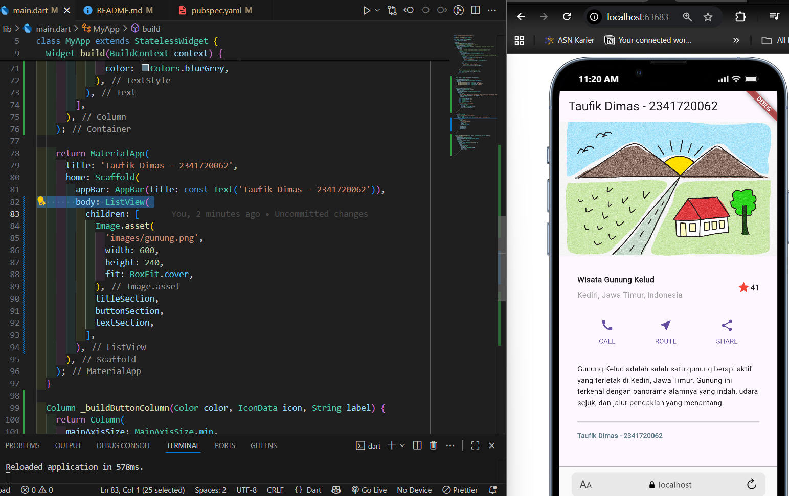

# **Codelab #06 | Layout dan si**

---

## **Praktikum 1: Membangun Layout di Flutter**

### **Langkah 1: Buat Project Baru**

> Buatlah sebuah project flutter baru dengan nama layout_flutter. Atau sesuaikan style laporan praktikum yang Anda buat.


### **Langkah 2: Buka file lib/main.dart**

> Buka file main.dart lalu ganti dengan kode berikut. Isi nama dan NIM Anda di text title


### **Langkah 3: Identifikasi layout diagram**

> 1. Struktur utama, Satu kolom besar yang berisi:
>
> - Gambar (banner)
> - Baris Judul
> - Baris Tombol
> - Blok teks deskripsi
>
> 2. Baris Judul:
>
> - Kolom teks (judul + subjudul) → dibungkus Expanded agar fleksibel
> - Ikon bintang
> - Angka rating
>
> 3. Baris Tombol:
>
> - 3 kolom, masing-masing berisi ikon + teks (misal: Call, Route, Share)
>
> 4. Layout tambahan:
>
> - Menggunakan grid sederhana (Row/Column)
> - Tidak ada elemen tumpang-tindih
> - Alignment, padding, dan border diatur agar rapi

### **Langkah 4 : Implementasi title row**

> Kode Program

```
import 'package:flutter/material.dart';

void main() => runApp(const MyApp());

class MyApp extends StatelessWidget {
  const MyApp({super.key});

  @override
  Widget build(BuildContext context) {
    // --- Langkah 4: Implementasi title row ---
    Widget titleSection = Container(
      padding: const EdgeInsets.all(32), // padding di sepanjang tepi 32 piksel
      child: Row(
        children: [
          // Soal 1: Column di dalam Expanded + crossAxisAlignment.start
          Expanded(
            child: Column(
              crossAxisAlignment: CrossAxisAlignment.start,
              children: [
                // Soal 2: Baris pertama teks dalam Container dengan bottom padding 8
                Container(
                  padding: const EdgeInsets.only(bottom: 8),
                  child: const Text(
                    'Wisata Gunung Kelud',
                    style: TextStyle(fontWeight: FontWeight.bold),
                  ),
                ),
                const Text(
                  'Kediri, Jawa Timur, Indonesia',
                  style: TextStyle(color: Colors.grey),
                ),
              ],
            ),
          ),
          // Soal 3: Icon bintang merah + teks "41"
          const Icon(Icons.star, color: Colors.red),
          const Text('41'),
        ],
      ),
    );

    return MaterialApp(
      title: 'Taufik Dimas - 2341720062',
      home: Scaffold(
        appBar: AppBar(title: const Text('Taufik Dimas - 2341720062')),
        // ganti body lama dengan titleSection
        body: titleSection,
      ),
    );
  }
}
```

> Tampilan


## **Praktikum 2: Implementasi button row1**

### **Langkah 1: Buat method Column_buildButtonColumn**

> Bagian tombol berisi 3 kolom yang menggunakan tata letak yang sama—sebuah ikon di atas baris teks. Kolom pada baris ini diberi jarak yang sama, dan teks serta ikon diberi warna primer.

> Karena kode untuk membangun setiap kolom hampir sama, buatlah metode pembantu pribadi bernama buildButtonColumn(), yang mempunyai parameter warna, Icon dan Text, sehingga dapat mengembalikan kolom dengan widgetnya sesuai dengan warna tertentu.

` lib/main.dart (_buildButtonColumn)`

> Kode Program

```
class MyApp extends StatelessWidget {
  const MyApp({super.key});

  @override
  Widget build(BuildContext context) {
    // ···
  }

  Column _buildButtonColumn(Color color, IconData icon, String label) {
    return Column(
      mainAxisSize: MainAxisSize.min,
      mainAxisAlignment: MainAxisAlignment.center,
      children: [
        Icon(icon, color: color),
        Container(
          margin: const EdgeInsets.only(top: 8),
          child: Text(
            label,
            style: TextStyle(
              fontSize: 12,
              fontWeight: FontWeight.w400,
              color: color,
            ),
          ),
        ),
      ],
    );
  }
}
```

### **Langkah 2: Buat widget buttonSection**

> Buat Fungsi untuk menambahkan ikon langsung ke kolom. Teks berada di dalam Container dengan margin hanya di bagian atas, yang memisahkan teks dari ikon.

> Bangun baris yang berisi kolom-kolom ini dengan memanggil fungsi dan set warna, Icon, dan teks khusus melalui parameter ke kolom tersebut. Sejajarkan kolom di sepanjang sumbu utama menggunakan MainAxisAlignment.spaceEvenly untuk mengatur ruang kosong secara merata sebelum, di antara, dan setelah setiap kolom. Tambahkan kode berikut tepat di bawah deklarasi titleSection di dalam metode build():

`lib/main.dart (buttonSection)`

> Kode Program

```
Color color = Theme.of(context).primaryColor;

Widget buttonSection = Row(
  mainAxisAlignment: MainAxisAlignment.spaceEvenly,
  children: [
    _buildButtonColumn(color, Icons.call, 'CALL'),
    _buildButtonColumn(color, Icons.near_me, 'ROUTE'),
    _buildButtonColumn(color, Icons.share, 'SHARE'),
  ],
);
```

### **Langkah 3: Tambah button section ke body**

> Tambahkan variabel buttonSection ke dalam body

#### **Tampilan Pratikum 3**


## **Praktikum 3: Implementasi text section**

### **Langkah 1: Buat widget textSection**

> Tentukan bagian teks sebagai variabel. Masukkan teks ke dalam Container dan tambahkan padding di sepanjang setiap tepinya. Tambahkan kode berikut tepat di bawah deklarasi buttonSection:

> Kode Program

```
Widget textSection = Container(
  padding: const EdgeInsets.all(32),
  child: const Text(
    'Carilah teks di internet yang sesuai '
    'dengan foto atau tempat wisata yang ingin '
    'Anda tampilkan. '
    'Tambahkan nama dan NIM Anda sebagai '
    'identitas hasil pekerjaan Anda. '
    'Selamat mengerjakan 🙂.',
    softWrap: true,
  ),
);
```

> - Dengan memberi nilai softWrap = true, baris teks akan memenuhi lebar kolom sebelum membungkusnya pada batas kata.

### **Langkah 2: Tambahkan variabel text section ke body**

> Tambahkan widget variabel textSection ke dalam body

#### **Tampilan Output Pratikum 3**


## **Praktikum 4: Implementasi image section**

### **Langkah 1: Siapkan aset gambar**

> mencari gambar di internet yang ingin ditampilkan. Buatlah folder images di root project layout_flutter. Masukkan file gambar tersebut ke folder images, lalu set nama file tersebut ke file pubspec.yaml


### **Langkah 2: Tambahkan gambar ke body**

> Tambahkan aset gambar ke dalam body


> - BoxFit.cover memberi tahu kerangka kerja bahwa gambar harus sekecil mungkin tetapi menutupi seluruh kotak rendernya.

### **Langkah 3: Terakhir, ubah menjadi ListView**

> Pada langkah terakhir ini, atur semua elemen dalam ListView, bukan Column, karena ListView mendukung scroll yang dinamis saat aplikasi dijalankan pada perangkat yang resolusinya lebih kecil.



## **Tugas Pratikum 1**

> Silakan implementasikan di project baru "basic_layout_flutter" dengan mengakses sumber ini: https://docs.flutter.dev/codelabs/layout-basics

> Kode Program

```
import 'package:flutter/material.dart';

void main() => runApp(const MyApp());

class MyApp extends StatelessWidget {
  const MyApp({super.key});

  @override
  Widget build(BuildContext context) {
    Widget titleSection = Padding(
      padding: const EdgeInsets.symmetric(horizontal: 16, vertical: 18),
      child: Row(
        crossAxisAlignment: CrossAxisAlignment.center,
        children: [
          // Thumbnail
          Container(
            width: 64,
            height: 64,
            decoration: BoxDecoration(
              color: Colors.blueGrey.shade50,
              shape: BoxShape.circle,
            ),
            child: const Icon(Icons.terrain, size: 40, color: Colors.blueGrey),
          ),
          const SizedBox(width: 16),
          // Title & location
          Expanded(
            child: Column(
              crossAxisAlignment: CrossAxisAlignment.start,
              children: const [
                Text(
                  'Wisata Gunung Kelud',
                  style: TextStyle(fontWeight: FontWeight.bold, fontSize: 18),
                ),
                SizedBox(height: 4),
                Text(
                  'Kediri, Jawa Timur',
                  style: TextStyle(color: Colors.grey, fontSize: 14),
                ),
              ],
            ),
          ),
          // Rating
          Row(
            children: const [
              Icon(Icons.star_rounded, color: Colors.amber, size: 22),
              SizedBox(width: 4),
              Text(
                '4.8',
                style: TextStyle(
                  fontWeight: FontWeight.bold,
                  fontSize: 16,
                  color: Colors.black87,
                ),
              ),
            ],
          ),
        ],
      ),
    );

    // Button section
    final Color iconColor = Theme.of(context).primaryColor;

    Widget buttonSection = Container(
      height: 100,
      padding: const EdgeInsets.symmetric(horizontal: 16, vertical: 12),
      child: Container(
        decoration: BoxDecoration(
          color: Colors.grey.shade100,
          borderRadius: BorderRadius.circular(8),
          border: Border.all(color: Colors.grey.shade300),
        ),
        padding: const EdgeInsets.symmetric(horizontal: 8),
        child: Row(
          mainAxisAlignment: MainAxisAlignment.spaceEvenly,
          children: [
            _buildButtonColumn(iconColor, Icons.call, 'CALL'),
            _buildButtonColumn(iconColor, Icons.near_me, 'ROUTE'),
            _buildButtonColumn(iconColor, Icons.share, 'SHARE'),
          ],
        ),
      ),
    );

    // Text section
    Widget textSection = Container(
      padding: const EdgeInsets.symmetric(horizontal: 16, vertical: 8),
      child: Card(
        elevation: 4,
        shape: RoundedRectangleBorder(borderRadius: BorderRadius.circular(8)),
        child: Padding(
          padding: const EdgeInsets.symmetric(horizontal: 12, vertical: 12),
          child: Column(
            crossAxisAlignment: CrossAxisAlignment.start,
            children: <Widget>[
              const Text(
                'Gunung Kelud adalah salah satu gunung berapi aktif yang terletak di Kediri, Jawa Timur. Gunung ini terkenal dengan panorama alamnya yang indah, udara sejuk, dan jalur pendakian yang menantang.',
                style: TextStyle(
                  fontSize: 13,
                  height: 1.4,
                  color: Colors.black87,
                ),
              ),
              const SizedBox(height: 12),
              const Divider(),
              const SizedBox(height: 8),
              Row(
                children: const [
                  Expanded(
                    child: Text(
                      'Taufik Dimas - 2341720062',
                      style: TextStyle(
                        fontSize: 12,
                        fontWeight: FontWeight.bold,
                        color: Colors.blueGrey,
                      ),
                    ),
                  ),
                ],
              ),
              const SizedBox(height: 8),
            ],
          ),
        ),
      ),
    );

    return MaterialApp(
      title: 'Taufik Dimas - 2341720062',
      home: Scaffold(
        appBar: AppBar(title: const Text('Taufik Dimas - 2341720062')),
        body: ListView(
          children: [
            Image.asset(
              'images/gunung.png',
              width: 600,
              height: 240,
              fit: BoxFit.cover,
            ),
            titleSection,
            buttonSection,
            textSection,
          ],
        ),
      ),
    );
  }

  Column _buildButtonColumn(Color color, IconData icon, String label) {
    return Column(
      mainAxisSize: MainAxisSize.min,
      mainAxisAlignment: MainAxisAlignment.center,
      children: [
        Icon(icon, color: color),
        Container(
          margin: const EdgeInsets.only(top: 8),
          child: Text(
            label,
            style: TextStyle(
              fontSize: 12,
              fontWeight: FontWeight.w400,
              color: color,
            ),
          ),
        ),
      ],
    );
  }
}
```

> Tampilan Hasil


## **Praktikum 5: Membangun Navigasi di Flutter**

### **Langkah 1: Siapkan project baru**


### **Langkah 2: Mendefinisikan Route**

> - Buatlah dua buah file dart dengan nama home_page.dart dan item_page.dart pada folder pages. Untuk masing-masing file, deklarasikan class HomePage pada file home_page.dart dan ItemPage pada item_page.dart. Turunkan class dari StatelessWidget

> - item_page.dart

```
import 'package:flutter/material.dart';

class ItemPage extends StatelessWidget {

  @override
  Widget build(BuildContext context) {
    return Scaffold(
      appBar: AppBar(title: const Text('Item Page')),
      body: const Center(child: Text('Ini adalah halaman Item')),
    );
  }
}
```

> - home_page.dart

```
import 'package:flutter/material.dart';

class HomePage extends StatelessWidget {
  static const String routeName = '/home';

  @override
  Widget build(BuildContext context) {
    return Scaffold(
      appBar: AppBar(title: const Text('Home Page')),
      body: const Center(child: Text('Welcome to Home Page')),
    );
  }
}
```

### **Langkah 3: Lengkapi Kode di main.dart**

> Setelah kedua halaman telah dibuat dan didefinisikan, bukalah file main.dart. Pada langkah ini anda akan mendefinisikan Route untuk kedua halaman tersebut. Definisi penamaan route harus bersifat unique. Halaman HomePage didefinisikan sebagai /. Dan halaman ItemPage didefinisikan sebagai /item. Untuk mendefinisikan halaman awal, anda dapat menggunakan named argument initialRoute.

> Kode Program

```
import 'package:flutter/material.dart';
import 'package:belanja_27/pages/home_page.dart';
import 'package:belanja_27/pages/item_page.dart';

void main() {
  runApp(const MyApp());
}

class MyApp extends StatelessWidget {
  const MyApp({super.key});

  @override
  Widget build(BuildContext context) {
    return MaterialApp(
      title: 'Tumbas App',
      initialRoute: '/',
      routes: {
        '/': (context) => const HomePage(),
        '/item': (context) => const ItemPage(),
      },
      theme: ThemeData(
        colorScheme: ColorScheme.fromSeed(seedColor: Colors.deepPurple),
      ),
    );
  }
}
```

### **Langkah 4: Membuat data model**

> Sebelum melakukan perpindahan halaman dari HomePage ke ItemPage, dibutuhkan proses pemodelan data. Pada desain mockup, dibutuhkan dua informasi yaitu nama dan harga. Untuk menangani hal ini, buatlah sebuah file dengan nama item.dart dan letakkan pada folder models. Pada file ini didefinisikan pemodelan data yang dibutuhkan. Ilustrasi kode yang dibutuhkan

> item.dart

```
class Item {
  final String name;
  final int price;

  Item({required this.name, required this.price});
}
```

### **Langkah 5: Lengkapi kode di class HomePage**

> Pada halaman HomePage terdapat ListView widget. Sumber data ListView diambil dari model List dari object Item

> Kode Program

```
import 'package:flutter/material.dart';
import 'package:belanja_27/models/item.dart';

class HomePage extends StatelessWidget {
  static const String routeName = '/';
  const HomePage({Key? key}) : super(key: key);

  final List<Item> items = const [
    Item(name: 'Sugar', price: 5000),
    Item(name: 'Salt', price: 2000),
  ];

  @override
  Widget build(BuildContext context) {
    return Scaffold(
      appBar: AppBar(title: const Text('Tumbas App')),
      body: ListView.builder(
        itemCount: items.length,
        itemBuilder: (context, index) {
          final item = items[index];
          return ListTile(
            title: Text(item.name),
            subtitle: Text('Price: Rp ${item.price}'),
            onTap: () => Navigator.pushNamed(context, '/item'),
          );
        },
      ),
    );
  }
}
```


### **Langkah 6: Membuat ListView dan itemBuilder**

> Untuk menampilkan ListView pada praktikum ini digunakan itemBuilder. Data diambil dari definisi model yang telah dibuat sebelumnya. Untuk menunjukkan batas data satu dan berikutnya digunakan widget Card

> Tampilan


### **Langkah 7: Menambahkan aksi pada ListView**

> Item pada ListView saat ini ketika ditekan masih belum memberikan aksi tertentu. Untuk menambahkan aksi pada ListView dapat digunakan widget InkWell atau GestureDetector. Perbedaan utamanya InkWell merupakan material widget yang memberikan efek ketika ditekan. Sedangkan GestureDetector bersifat umum dan bisa juga digunakan untuk gesture lain selain sentuhan. Pada praktikum ini akan digunakan widget InkWell.


## **Tugas Pratikum 2**

> 1. Untuk melakukan pengiriman data ke halaman berikutnya, cukup menambahkan informasi arguments pada penggunaan Navigator<br>

```
itemBuilder: (context, index) {
          final item = items[index];
          return ListTile(
            title: Text(item.name),
            subtitle: Text('Price: Rp ${item.price}'),
            onTap: () => Navigator.pushNamed(context, '/item'),
          );
        },
```

> 2. Pembacaan nilai yang dikirimkan pada halaman sebelumnya dapat dilakukan menggunakan ModalRoute. Tambahkan kode berikut pada blok fungsi build dalam halaman ItemPage. Setelah nilai didapatkan, anda dapat menggunakannya seperti penggunaan variabel pada umumnya.<br>

```
Widget build(BuildContext context) {
  final itemArgs = (widget.item ?? ModalRoute.of(context)?.settings.arguments) as Item;
    final photos = itemArgs.photos.isNotEmpty
        ? itemArgs.photos
        : (itemArgs.photo != null ? [itemArgs.photo!] : []);
```

> 3. Pada hasil akhir dari aplikasi belanja yang telah anda selesaikan, tambahkan atribut foto produk, stok, dan rating. Ubahlah tampilan menjadi GridView seperti di aplikasi marketplace pada umumnya.<br>


> 4. Silakan implementasikan Hero widget pada aplikasi belanja


> 5. Sesuaikan dan modifikasi tampilan sehingga menjadi aplikasi yang menarik. Selain itu, pecah widget menjadi kode yang lebih kecil. Tambahkan Nama dan NIM di footer aplikasi belanja Anda.

> - Pecah Widget


> - Modifikasi


> 6. Selesaikan Praktikum 5: Navigasi dan Rute tersebut. Cobalah modifikasi menggunakan plugin go_router,

> Plugin GoRouter

```
import 'package:flutter/material.dart';
import 'package:go_router/go_router.dart';
import 'pages/home_page.dart';
import 'pages/item_page.dart';

void main() => runApp(const MyApp());

final GoRouter _router = GoRouter(
  initialLocation: '/',
  routes: [
    GoRoute(
      path: '/',
      builder: (context, state) => HomePage(),
    ),
    GoRoute(
      path: '/item',
      builder: (context, state) {
        final item = state.extra as dynamic?;
        return ItemPage(item: item);
      },
    ),
  ],
);
```
