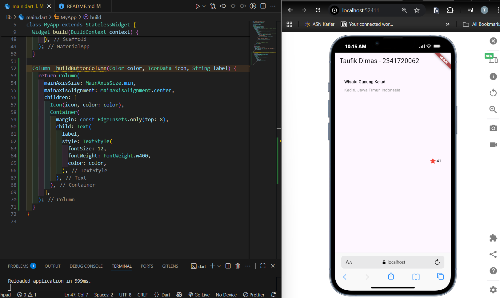

# **Codelab #06 | Layout dan Navigasi**

---

## **Praktikum 1: Membangun Layout di Flutter**

### **Langkah 1: Buat Project Baru**

> Buatlah sebuah project flutter baru dengan nama layout_flutter. Atau sesuaikan style laporan praktikum yang Anda buat.


### **Langkah 2: Buka file lib/main.dart**

> Buka file main.dart lalu ganti dengan kode berikut. Isi nama dan NIM Anda di text title


### **Langkah 3: Identifikasi layout diagram**

> 1. Struktur utama, Satu kolom besar yang berisi:
>
> - Gambar (banner)
> - Baris Judul
> - Baris Tombol
> - Blok teks deskripsi
>
> 2. Baris Judul:
>
> - Kolom teks (judul + subjudul) → dibungkus Expanded agar fleksibel
> - Ikon bintang
> - Angka rating
>
> 3. Baris Tombol:
>
> - 3 kolom, masing-masing berisi ikon + teks (misal: Call, Route, Share)
>
> 4. Layout tambahan:
>
> - Menggunakan grid sederhana (Row/Column)
> - Tidak ada elemen tumpang-tindih
> - Alignment, padding, dan border diatur agar rapi

### **Langkah 4 : Implementasi title row**

> Kode Program

```
import 'package:flutter/material.dart';

void main() => runApp(const MyApp());

class MyApp extends StatelessWidget {
  const MyApp({super.key});

  @override
  Widget build(BuildContext context) {
    // --- Langkah 4: Implementasi title row ---
    Widget titleSection = Container(
      padding: const EdgeInsets.all(32), // padding di sepanjang tepi 32 piksel
      child: Row(
        children: [
          // Soal 1: Column di dalam Expanded + crossAxisAlignment.start
          Expanded(
            child: Column(
              crossAxisAlignment: CrossAxisAlignment.start,
              children: [
                // Soal 2: Baris pertama teks dalam Container dengan bottom padding 8
                Container(
                  padding: const EdgeInsets.only(bottom: 8),
                  child: const Text(
                    'Wisata Gunung Kelud',
                    style: TextStyle(fontWeight: FontWeight.bold),
                  ),
                ),
                const Text(
                  'Kediri, Jawa Timur, Indonesia',
                  style: TextStyle(color: Colors.grey),
                ),
              ],
            ),
          ),
          // Soal 3: Icon bintang merah + teks "41"
          const Icon(Icons.star, color: Colors.red),
          const Text('41'),
        ],
      ),
    );

    return MaterialApp(
      title: 'Taufik Dimas - 2341720062',
      home: Scaffold(
        appBar: AppBar(title: const Text('Taufik Dimas - 2341720062')),
        // ganti body lama dengan titleSection
        body: titleSection,
      ),
    );
  }
}
```

> Tampilan



## **Praktikum 2: Implementasi button row1**

### **Langkah 1: Buat method Column_buildButtonColumn**

> Bagian tombol berisi 3 kolom yang menggunakan tata letak yang sama—sebuah ikon di atas baris teks. Kolom pada baris ini diberi jarak yang sama, dan teks serta ikon diberi warna primer.

> Karena kode untuk membangun setiap kolom hampir sama, buatlah metode pembantu pribadi bernama buildButtonColumn(), yang mempunyai parameter warna, Icon dan Text, sehingga dapat mengembalikan kolom dengan widgetnya sesuai dengan warna tertentu.

` lib/main.dart (_buildButtonColumn)`

> Kode Program

```
class MyApp extends StatelessWidget {
  const MyApp({super.key});

  @override
  Widget build(BuildContext context) {
    // ···
  }

  Column _buildButtonColumn(Color color, IconData icon, String label) {
    return Column(
      mainAxisSize: MainAxisSize.min,
      mainAxisAlignment: MainAxisAlignment.center,
      children: [
        Icon(icon, color: color),
        Container(
          margin: const EdgeInsets.only(top: 8),
          child: Text(
            label,
            style: TextStyle(
              fontSize: 12,
              fontWeight: FontWeight.w400,
              color: color,
            ),
          ),
        ),
      ],
    );
  }
}
```

### **Langkah 2: Buat widget buttonSection**

> Buat Fungsi untuk menambahkan ikon langsung ke kolom. Teks berada di dalam Container dengan margin hanya di bagian atas, yang memisahkan teks dari ikon.

> Bangun baris yang berisi kolom-kolom ini dengan memanggil fungsi dan set warna, Icon, dan teks khusus melalui parameter ke kolom tersebut. Sejajarkan kolom di sepanjang sumbu utama menggunakan MainAxisAlignment.spaceEvenly untuk mengatur ruang kosong secara merata sebelum, di antara, dan setelah setiap kolom. Tambahkan kode berikut tepat di bawah deklarasi titleSection di dalam metode build():

`lib/main.dart (buttonSection)`

> Kode Program

```
Color color = Theme.of(context).primaryColor;

Widget buttonSection = Row(
  mainAxisAlignment: MainAxisAlignment.spaceEvenly,
  children: [
    _buildButtonColumn(color, Icons.call, 'CALL'),
    _buildButtonColumn(color, Icons.near_me, 'ROUTE'),
    _buildButtonColumn(color, Icons.share, 'SHARE'),
  ],
);
```

### **Langkah 3: Tambah button section ke body**

> Tambahkan variabel buttonSection ke dalam body

#### **Tampilan Pratikum 3**


## **Praktikum 3: Implementasi text section**

### **Langkah 1: Buat widget textSection**

> Tentukan bagian teks sebagai variabel. Masukkan teks ke dalam Container dan tambahkan padding di sepanjang setiap tepinya. Tambahkan kode berikut tepat di bawah deklarasi buttonSection:

> Kode Program

```
Widget textSection = Container(
  padding: const EdgeInsets.all(32),
  child: const Text(
    'Carilah teks di internet yang sesuai '
    'dengan foto atau tempat wisata yang ingin '
    'Anda tampilkan. '
    'Tambahkan nama dan NIM Anda sebagai '
    'identitas hasil pekerjaan Anda. '
    'Selamat mengerjakan 🙂.',
    softWrap: true,
  ),
);
```

> - Dengan memberi nilai softWrap = true, baris teks akan memenuhi lebar kolom sebelum membungkusnya pada batas kata.

### **Langkah 2: Tambahkan variabel text section ke body**

> Tambahkan widget variabel textSection ke dalam body

#### **Tampilan Output Pratikum 3**


## **Praktikum 4: Implementasi image section**

### **Langkah 1: Siapkan aset gambar**

> mencari gambar di internet yang ingin ditampilkan. Buatlah folder images di root project layout_flutter. Masukkan file gambar tersebut ke folder images, lalu set nama file tersebut ke file pubspec.yaml


### **Langkah 2: Tambahkan gambar ke body**

> Tambahkan aset gambar ke dalam body


> - BoxFit.cover memberi tahu kerangka kerja bahwa gambar harus sekecil mungkin tetapi menutupi seluruh kotak rendernya.

### **Langkah 3: Terakhir, ubah menjadi ListView**

> Pada langkah terakhir ini, atur semua elemen dalam ListView, bukan Column, karena ListView mendukung scroll yang dinamis saat aplikasi dijalankan pada perangkat yang resolusinya lebih kecil.


