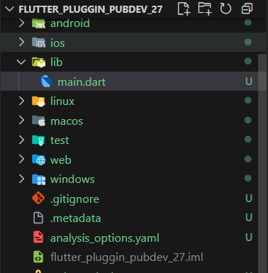
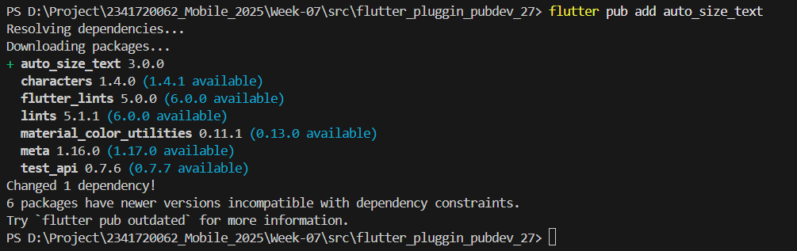
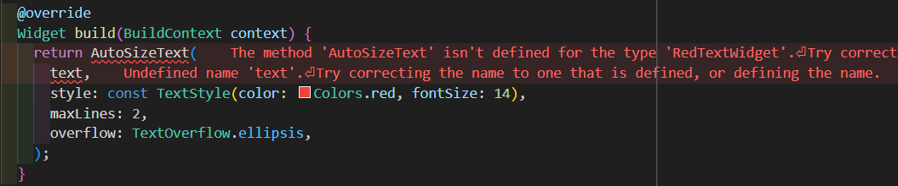
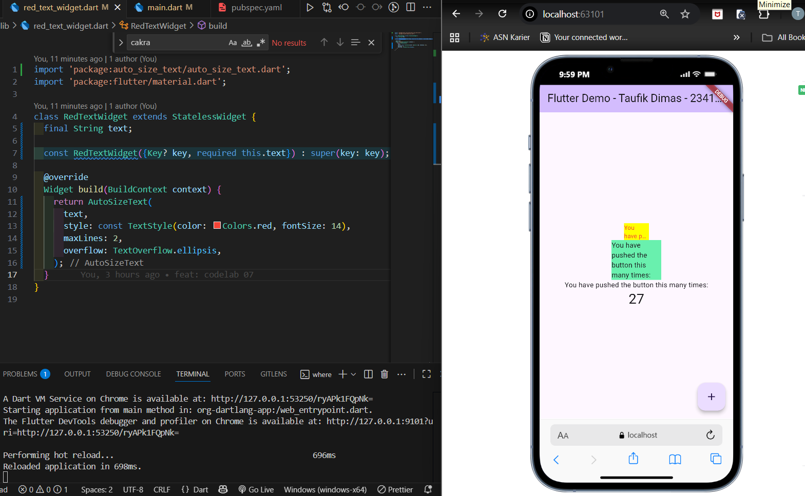

# **Codelab #07 | Manajemen Pluggin**

---

## **Praktikum 1: Membangun Layout di Flutter**

### **Langkah 1: Buat Project Baru**

> Buatlah sebuah project flutter baru dengan nama flutter_plugin_pubdev. Lalu jadikan repository di GitHub Anda dengan nama flutter_plugin_pubdev27.



### **Langkah 2: Menambahkan Plugin**

> Tambahkan plugin auto_size_text menggunakan perintah berikut di terminal



> file pubspec.yaml

```
dependencies:
  flutter:
    sdk: flutter
  cupertino_icons: ^1.0.8
  auto_size_text: ^3.0.0
```

### **Langkah 3: Buat file red_text_widget.dart**

> Buat file baru bernama red_text_widget.dart di folder lib

```
import 'package:flutter/material.dart';

class RedTextWidget extends StatelessWidget {
  const RedTextWidget({Key? key}) : super(key: key);

  @override
  Widget build(BuildContext context) {
    return Container();
  }
}
```

### **Langkah 4: Tambah Widget AutoSizeText**

> Masih di file red_text_widget.dart, untuk menggunakan plugin auto_size_text, ubahlah kode return Container()

> Tampilan error



> - Error "The method 'AutoSizeText' isn't defined" karena widget AutoSizeText belum di-import ke dalam file, Perlu menambahkan import statement untuk plugin auto_size_text:
> - Error: "Undefined name 'text'" karena parameter text tidak didefinisikan dalam widget ini, Perlu menambahkan parameter text ke dalam constructor widget:

> Kode Program benar

```
import 'package:auto_size_text/auto_size_text.dart';
import 'package:flutter/material.dart';

class RedTextWidget extends StatelessWidget {
  final String text;

  const RedTextWidget({Key? key, required this.text}) : super(key: key);

  @override
  Widget build(BuildContext context) {
    return AutoSizeText(
      text,
      style: const TextStyle(color: Colors.red, fontSize: 14),
      maxLines: 2,
      overflow: TextOverflow.ellipsis,
    );
  }
}

```

### **Langkah 5: Buat Variabel text dan parameter di constructor**

> Tambahkan variabel text dan parameter di constructor

```
final String text;

const RedTextWidget({Key? key, required this.text}) : super(key: key);
```

### **Langkah 6: Tambahkan widget di main.dart**

> Buka file main.dart lalu tambahkan di dalam children: pada class \_MyHomePageState

> Tampilan Moblie



## Tugas Pratikum

1. Selesaikan Praktikum tersebut, lalu dokumentasikan dan push ke repository Anda berupa screenshot hasil pekerjaan beserta penjelasannya di file README.md!
   > Proyek Flutter dengan nama flutter_plugin_pubdev berhasil dijalankan menggunakan plugin auto_size_text.<br>
   > Plugin ini digunakan untuk menampilkan teks yang otomatis menyesuaikan ukuran font agar tetap muat dalam batas lebar widget<br>
2. Jelaskan maksud dari langkah 2 pada praktikum tersebut!
   > Langkah 2 bertujuan untuk menambahkan plugin eksternal dari pub.dev ke dalam proyek Flutter.<br>
   > Perintah:<br> > `flutter pub add auto_size_text`<br>
   > Plugin auto_size_text digunakan untuk membuat teks secara otomatis menyesuaikan ukuran font agar tetap terlihat penuh di dalam area widget tanpa terpotong.<br>
   > Setelah ditambahkan, nama plugin akan muncul di pubspec.yaml pada bagian dependencies, yang artinya Flutter sudah siap menggunakan library tersebut di dalam kode program.<br>
3. Jelaskan maksud dari langkah 5 pada praktikum tersebut!
   > Langkah 5 menambahkan variabel text dan parameter di constructor seperti berikut:<br>

```
final String text;
const RedTextWidget({Key? key, required this.text}) : super(key: key);
```

> Tujuannya adalah agar widget RedTextWidget dapat menerima nilai teks dari luar melalui parameter.<br>
> final String text menyimpan data teks yang akan ditampilkan.<br>
> required this.text memastikan bahwa parameter text wajib diisi setiap kali widget dipanggil.<br>
> Dengan cara ini, widget menjadi lebih fleksibel dan dapat digunakan kembali dengan isi teks yang berbeda-beda.

4. Pada langkah 6 terdapat dua widget yang ditambahkan, jelaskan fungsi dan perbedaannya!

Dua widget memiliki fungsi dan perbedaan berikut:

_Container pertama (Kuning dengan RedTextWidget):_

- Warna background: Colors.yellowAccent
- Lebar: 50 pixel
- Child widget: RedTextWidget yang berisi AutoSizeText
- Fungsi: Menunjukkan kemampuan auto sizing text
- Behavior: teks otomatis mengecil agar muat, berwarna merah

_Container kedua (Hijau dengan Text):_

- Warna background: Colors.greenAccent
- Lebar: 100 pixel
- Child widget: Text standar Flutter
- Fungsi: Pembanding tampilan teks biasa
- Behavior: teks bisa overflow atau terpotong

_Perbedaan:_

- Container pertama menyesuaikan ukuran font otomatis.
- Container kedua tidak menyesuaikan font dan bisa overflow.

---

5. Jelaskan maksud dari tiap parameter yang ada di dalam plugin auto_size_text berdasarkan tautan pada dokumentasi ini !

- text → isi teks yang ditampilkan
- style → pengaturan tampilan teks (warna, ukuran, font)
- maxLines → jumlah baris maksimal teks
- overflow → perilaku teks jika melebihi batas (misal ellipsis)
- minFontSize → ukuran font minimum saat menyesuaikan
- maxFontSize → ukuran font maksimum
- stepGranularity → interval penyesuaian ukuran font (semakin kecil semakin halus)
- presetFontSizes → daftar ukuran font yang dicoba satu per satu
- textAlign → posisi teks (kiri, tengah, kanan)
- wrapWords → jika false, teks panjang tidak dibungkus ke baris berikut
- overflowReplacement → widget pengganti jika teks tidak muat sepenuhnya

---

6. Kumpulkan laporan praktikum Anda berupa link repository GitHub kepada dosen!

> SAMPUNN
