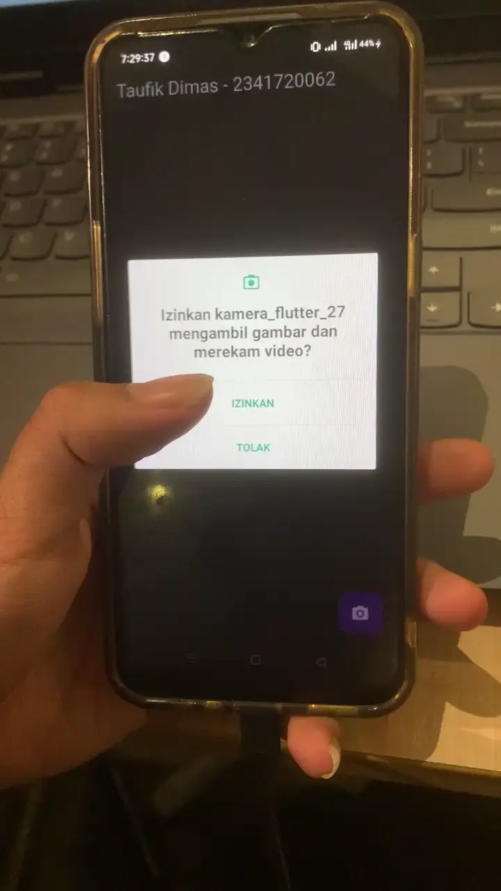
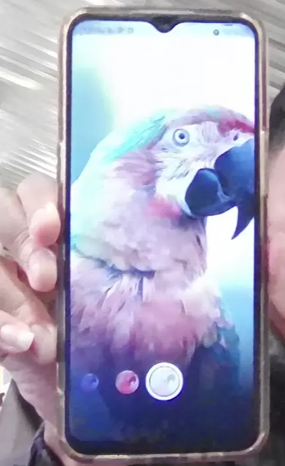
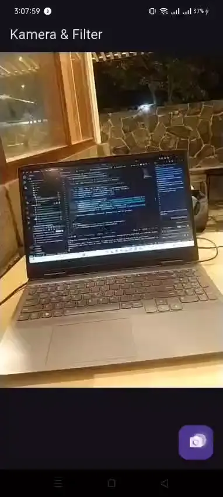

# **Codelab #09 | Kamera**

---

## **Praktikum 1: Mengambil Foto dengan Kamera di Flutter**

### **Langkah **

> Hasil Program
>
> 

## **Praktikum 2: Membuat photo filter carousel**

> Hasil Program
>
> 

## **Tugas Pratikum: Gabungan Pratikum 1 dan Pratikum 2**

> Hasil Program
>
> 

## **Pertanyaan**

1. Jelaskan maksud void async pada praktikum 1
2. Jelaskan fungsi dari anotasi @immutable dan @override
