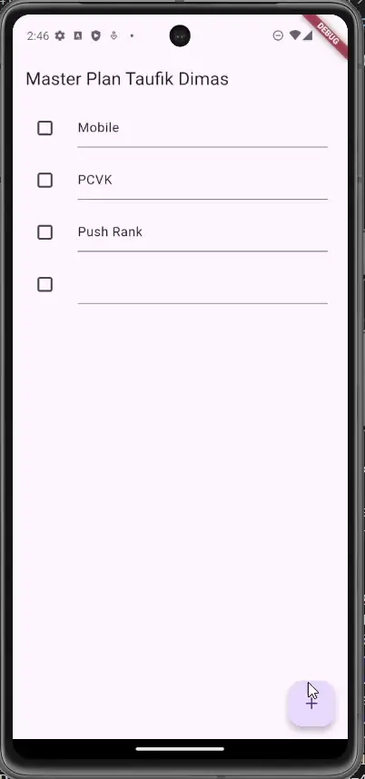

# Codelab #10 — Dasar State Management

---

## Praktikum 1: Dasar State dengan Model-View

## Langkah 1: Buat Project Baru

Buatlah sebuah project flutter baru dengan nama master_plan di folder src week-10 repository GitHub Anda atau sesuai style laporan praktikum yang telah disepakati. Lalu buatlah susunan folder dalam project seperti gambar berikut ini.

## Langkah 2: Membuat model task.dart

Praktik terbaik untuk memulai adalah pada lapisan data (data layer). Ini akan memberi Anda gambaran yang jelas tentang aplikasi Anda, tanpa masuk ke detail antarmuka pengguna Anda. Di folder model, buat file bernama task.dart dan buat class Task. Class ini memiliki atribut description dengan tipe data String dan complete dengan tipe data Boolean, serta ada konstruktor. Kelas ini akan menyimpan data tugas untuk aplikasi kita. Tambahkan kode berikut:

```dart
class Task {
  final String description;
  final bool complete;

  const Task({
    this.complete = false,
    this.description = '',
  });
}
```

## Langkah 3: Buat file plan.dart

Kita juga perlu sebuah List untuk menyimpan daftar rencana dalam aplikasi to-do ini. Buat file plan.dart di dalam folder models dan isi kode seperti berikut.

```dart
import './task.dart';

class Plan {
  final String name;
  final List<Task> tasks;

  const Plan({this.name = '', this.tasks = const []});
}
```

### Langkah 4: Buat file data_layer.dart

Kita dapat membungkus beberapa data layer ke dalam sebuah file yang nanti akan mengekspor kedua model tersebut. Dengan begitu, proses impor akan lebih ringkas seiring berkembangnya aplikasi. Buat file bernama data_layer.dart di folder models. Kodenya hanya berisi export seperti berikut.

```dart
export 'plan.dart';
export 'task.dart';
```

### Langkah 5: Pindah ke file main.dart

Hapus semua kode yang ada di dalam `main.dart` dan ganti dengan kode ini

```dart
import 'package:flutter/material.dart';
import './views/plan_screen.dart';

void main() => runApp(MasterPlanApp());

class MasterPlanApp extends StatelessWidget {
  const MasterPlanApp({super.key});

  @override
  Widget build(BuildContext context) {
    return MaterialApp(
     theme: ThemeData(primarySwatch: Colors.purple),
     home: PlanScreen(),
    );
  }
}
```

### Langkah 6: buat plan_screen.dart

Pada folder views, buatlah sebuah file plan_screen.dart dan gunakan templat StatefulWidget untuk membuat class PlanScreen. Isi kodenya adalah sebagai berikut. Gantilah teks ‘Namaku' dengan nama panggilan Anda pada title AppBar.

```dart
import '../models/data_layer.dart';
import 'package:flutter/material.dart';

class PlanScreen extends StatefulWidget {
  const PlanScreen({super.key});

  @override
  State createState() => _PlanScreenState();
}

class _PlanScreenState extends State<PlanScreen> {
  Plan plan = const Plan();

  @override
  Widget build(BuildContext context) {
   return Scaffold(

    appBar: AppBar(title: const Text('Master Plan Muhammad Rifda Musyaffa')),
    body: _buildList(),
    floatingActionButton: _buildAddTaskButton(),
   );
  }
}
```

### Langkah 7: buat method \_buildAddTaskButton()

Anda akan melihat beberapa error di langkah 6, karena method yang belum dibuat. Ayo kita buat mulai dari yang paling mudah yaitu tombol Tambah Rencana. Tambah kode berikut di bawah method build di dalam class \_PlanScreenState.

```dart
Widget _buildAddTaskButton() {
    return FloatingActionButton(
     child: const Icon(Icons.add),
     onPressed: () {
       setState(() {
        plan = Plan(
         name: plan.name,
         tasks: List<Task>.from(plan.tasks)
         ..add(const Task()),
       );
      });
     },
    );
  }
```

### Langkah 8: buat widget \_buildList()

Kita akan buat widget berupa List yang dapat dilakukan scroll, yaitu ListView.builder. Buat widget ListView seperti kode berikut ini.

```dart
Widget _buildList() {
    return ListView.builder(
     itemCount: plan.tasks.length,
     itemBuilder: (context, index) =>
     _buildTaskTile(plan.tasks[index], index),
    );
  }
```

### Langkah 9: buat widget \_buildTaskTile

Dari langkah 8, kita butuh ListTile untuk menampilkan setiap nilai dari plan.tasks. Kita buat dinamis untuk setiap index data, sehingga membuat view menjadi lebih mudah. Tambahkan kode berikut ini

````dart
Widget _buildTaskTile(Task task, int index) {
    return ListTile(
      leading: Checkbox(
          value: task.complete,
          onChanged: (selected) {
            setState(() {
              plan = Plan(
                name: plan.name,
                tasks: List<Task>.from(plan.tasks)
                  ..[index] = Task(
                    description: task.description,
                    complete: selected ?? false,
                  ),
              );
            });
          }),
      title: TextFormField(
        initialValue: task.description,
        onChanged: (text) {
          setState(() {
            plan = Plan(
              name: plan.name,
              tasks: List<Task>.from(plan.tasks)
                ..[index] = Task(
                  description: text,
                  complete: task.complete,
                ),
            );
          });
        },
      ),
    );
  }

# Langkah 10: Tambah Scroll Controller

Anda dapat menambah tugas sebanyak-banyaknya, menandainya jika sudah beres, dan melakukan scroll jika sudah semakin banyak isinya. Namun, ada salah satu fitur tertentu di iOS perlu kita tambahkan. Ketika keyboard tampil, Anda akan kesulitan untuk mengisi yang paling bawah. Untuk mengatasi itu, Anda dapat menggunakan ScrollController untuk menghapus focus dari semua TextField selama event scroll dilakukan. Pada file plan_screen.dart, tambahkan variabel scroll controller di class State tepat setelah variabel plan.

```dart
late ScrollController scrollController;
````

# Langkah 11: Tambah Scroll Listener'

Tambahkan method initState() setelah deklarasi variabel scrollController seperti kode berikut.

```dart
@override
  void initState() {
    super.initState();
    scrollController = ScrollController()
      ..addListener(() {
        FocusScope.of(context).requestFocus(FocusNode());
      });
  }
```

# Langkah 12: Tambah controller dan keyboard behavior

Tambahkan controller dan keyboard behavior pada ListView di method \_buildList seperti kode berikut ini.

```dart
return ListView.builder(
  controller: scrollController,
 keyboardDismissBehavior: Theme.of(context).platform ==
 TargetPlatform.iOS
          ? ScrollViewKeyboardDismissBehavior.onDrag
          : ScrollViewKeyboardDismissBehavior.manual,
```

# Langkah 13: Terakhir, tambah method dispose()

Terakhir, tambahkan method dispose() berguna ketika widget sudah tidak digunakan lagi.

```dart
@override
  void dispose() {
    scrollController.dispose();
    super.dispose();
  }
```

## Hasil Pratikum



## Tugas Praktikum 1: Dasar State dengan Model-View

---

2. Maksud Langkah 4 dan alasan dilakukannya

- Penafsiran (asumsi): Langkah 4 biasanya meminta memisahkan logika/data (model) dari tampilan (view) — mis. memindahkan struktur data Plan/Task ke kelas model, atau menghubungkan model ke widget melalui `setState`, `InheritedWidget`/`Provider`, atau parameter konstruktor.
- Mengapa: Pemisahan ini mengikuti prinsip single responsibility dan arsitektur MV\* sehingga UI menjadi lebih sederhana, mudah diuji, dan mudah di-maintain. Dengan memisahkan model, perubahan data tidak bercampur langsung dengan logika tampilan.

3. Mengapa perlu variabel `plan` di Langkah 6? Mengapa dibuat konstanta?

- Penafsiran (asumsi): Langkah 6 meminta menyiapkan instance data awal (mis. sebuah `Plan` atau daftar `Plan`) yang akan ditampilkan pada view.
- Mengapa perlu: Variabel `plan` dibutuhkan untuk menyimpan data yang akan di-render di UI (judul, tanggal, daftar task, dsb.). Tanpa variabel tersebut, view tidak punya sumber data.
- Mengapa `const`/`final`: Jika data bersifat statis/immutable (tidak diubah setelah dibuat), mendeklarasikannya sebagai `const` atau `final` lebih aman dan dapat memberikan optimisasi performa pada Flutter:
  - `const` (hanya jika objek dan konstruktornya compile-time constant) memungkinkan Flutter melakukan canonicalization (objek sama dipakai ulang) dan mengurangi rebuild.
  - `final` cocok bila ingin immutability pada runtime (nilai hanya di-set sekali) tapi tidak bisa `const` karena bukan compile-time constant.

4. Hasil Langkah 9 (instruksi capture GIF) — apa yang dibuat?

- Penafsiran (asumsi): Langkah 9 biasanya menunjukkan interaksi utama aplikasi (mis. menambah plan, melihat detail, mengambil foto dengan kamera, atau preview hasil). Hasil yang harus dicapture adalah alur kerja tersebut.
- Contoh deskripsi yang harus ditulis setelah capture GIF:
  - Menjalankan aplikasi di emulator atau perangkat.
  - Menekan tombol "Tambah Plan" untuk membuat rencana baru.
  - Mengisi form, mengambil foto (jika ada integrasi kamera), lalu menyimpan.
  - Memastikan item baru muncul di daftar.

Tambahkan GIF yang menunjukkan langkah di atas dan jelaskan tiap aksi singkat di README.

5. Kegunaan method pada Langkah 11 dan 13 dalam lifecycle state

- Karena instruksi asli tidak disertakan, saya mengasumsikan dua method yang umum dibahas di lab state Flutter:

  - `initState()` — dipanggil sekali ketika `State` pertama kali dibuat. Kegunaan: melakukan inisialisasi (mis. mulai listener, fetch data awal, buat controller seperti `TextEditingController` atau `AnimationController`). Jangan panggil `BuildContext.dependOnInheritedWidgetOfExactType` di sini jika bergantung pada `InheritedWidget` yang bergantung pada context; gunakan `didChangeDependencies` untuk itu.
  - `dispose()` — dipanggil saat `State` dihapus permanen (widget di-destroy). Kegunaan: membersihkan resource (membatalkan subscription stream, membuang controller) untuk mencegah memory leak.

  - Jika Langkah 11/13 merujuk pada `didChangeDependencies()` atau `didUpdateWidget(oldWidget)`, kegunaannya:
  - `didChangeDependencies()` dipanggil setelah `initState` dan tiap kali dependensi InheritedWidget berubah — cocok untuk membaca data dari `InheritedWidget` atau `Provider`.
  - `didUpdateWidget(oldWidget)` dipanggil ketika widget konfigurasi baru diberikan kepada State — cocok untuk mereset atau memperbarui state yang bergantung pada properti widget lama vs baru.

---

## Praktikum 2: Mengelola Data Layer dengan InheritedWidget dan InheritedNotifier

# Langkah 1: Buat file plan_provider.dart

Buat folder baru provider di dalam folder lib, lalu buat file baru dengan nama plan_provider.dart berisi kode seperti berikut.

**Kode**

```dart
import 'package:flutter/material.dart';
import '../models/data_layer.dart';

class PlanProvider extends InheritedNotifier<ValueNotifier<Plan>> {
  const PlanProvider({super.key, required Widget child, required
   ValueNotifier<Plan> notifier})
  : super(child: child, notifier: notifier);

  static ValueNotifier<Plan> of(BuildContext context) {
   return context.
    dependOnInheritedWidgetOfExactType<PlanProvider>()!.notifier!;
  }
}
```

# Langkah 2: Edit main.dart

Gantilah pada bagian atribut home dengan PlanProvider seperti berikut. Jangan lupa sesuaikan bagian impor jika dibutuhkan.

```dart
import 'package:flutter/material.dart';
import './views/plan_screen.dart';
import './provider/plan_provider.dart';
import './models/data_layer.dart';

void main() => runApp(MasterPlanApp());

class MasterPlanApp extends StatelessWidget {
  const MasterPlanApp({super.key});

  @override
  Widget build(BuildContext context) {
    return MaterialApp(
      theme: ThemeData(primarySwatch: Colors.purple),
      home: PlanProvider(
        notifier: ValueNotifier<Plan>(const Plan()),
        child: const PlanScreen(),
      ),
    );
  }
}
```

# Langkah 3: Tambah method pada model plan.dart

Tambahkan dua method di dalam model class Plan sepe
rti kode berikut.

```dart
int get completedCount => tasks
  .where((task) => task.complete)
  .length;

String get completenessMessage =>
  '$completedCount out of ${tasks.length} tasks';
```

# Langkah 4: Pindah ke PlanScreen

Edit PlanScreen agar menggunakan data dari PlanProvider. Hapus deklarasi variabel plan (ini akan membuat error). Kita akan perbaiki pada langkah 5 berikut ini.

```dart
Plan plan = const Plan(); // <-- HAPUS BARIS INI
```

# Langkah 5: Edit method \_buildAddTaskButton

Tambahkan BuildContext sebagai parameter dan gunakan PlanProvider sebagai sumber datanya. Edit bagian kode seperti berikut.

```dart
Widget _buildAddTaskButton(BuildContext context) {
  ValueNotifier<Plan> planNotifier = PlanProvider.of(context);
  return FloatingActionButton(
    child: const Icon(Icons.add),
    onPressed: () {
      Plan currentPlan = planNotifier.value;
      planNotifier.value = Plan(
        name: currentPlan.name,
        tasks: List<Task>.from(currentPlan.tasks)..add(const Task()),
      );
    },
  );
}
```

# Langkah 6: Edit method \_buildTaskTile

Tambahkan parameter BuildContext, gunakan PlanProvider sebagai sumber data. Ganti TextField menjadi TextFormField untuk membuat inisial data provider menjadi lebih mudah.

```dart
Widget _buildTaskTile(Task task, int index, BuildContext context) {
  ValueNotifier<Plan> planNotifier = PlanProvider.of(context);
  return ListTile(
    leading: Checkbox(
       value: task.complete,
       onChanged: (selected) {
         Plan currentPlan = planNotifier.value;
         planNotifier.value = Plan(
           name: currentPlan.name,
           tasks: List<Task>.from(currentPlan.tasks)
             ..[index] = Task(
               description: task.description,
               complete: selected ?? false,
             ),
         );
       }),
    title: TextFormField(
      initialValue: task.description,
      onChanged: (text) {
        Plan currentPlan = planNotifier.value;
        planNotifier.value = Plan(
          name: currentPlan.name,
          tasks: List<Task>.from(currentPlan.tasks)
            ..[index] = Task(
              description: text,
              complete: task.complete,
            ),
        );
      },
    ),
  );
}
```

# Langkah 7: Edit \_buildList

Sesuaikan parameter pada bagian \_buildTaskTile seperti kode berikut.

```dart
Widget _buildList(Plan plan) {
   return ListView.builder(
     controller: scrollController,
     itemCount: plan.tasks.length,
     itemBuilder: (context, index) =>
        _buildTaskTile(plan.tasks[index], index, context),
   );
}
```

# Langkah 8: Tetap di class PlanScreen

Edit method build sehingga bisa tampil progress pada bagian bawah (footer). Caranya, bungkus (wrap) \_buildList dengan widget Expanded dan masukkan ke dalam widget Column seperti kode pada Langkah 9.

# Langkah 9: Tambah widget SafeArea

Terakhir, tambahkan widget SafeArea dengan berisi completenessMessage pada akhir widget Column. Perhatikan kode berikut ini.

```dart
@override
Widget build(BuildContext context) {
   return Scaffold(
     appBar: AppBar(title: const Text('Master Plan')),
     body: ValueListenableBuilder<Plan>(
       valueListenable: PlanProvider.of(context),
       builder: (context, plan, child) {
         return Column(
           children: [
             Expanded(child: _buildList(plan)),
             SafeArea(child: Text(plan.completenessMessage))
           ],
         );
       },
     ),
     floatingActionButton: _buildAddTaskButton(context),
   );
}
```

## Hasil Percobaan


Secara keseluruhan praktikum menunjukkan bagaimana memisahkan data layer dan UI menggunakan InheritedWidget/InheritedNotifier sehingga state dapat dibagikan dan dikelola dengan lebih
terstruktur.

## Pertanyaan Praktikum 2

1. Jelaskan mana yang dimaksud InheritedWidget pada langkah 1 tersebut! Mengapa yang digunakan InheritedNotifier?

   - `InheritedWidget` adalah mekanisme bawaan Flutter untuk menyampaikan data ke subtree
     widget melalui `BuildContext`. Widget di subtree bisa memanggil
     `context.dependOnInheritedWidgetOfExactType<T>()` untuk membaca data dan menjadi dependent
     sehingga akan rebuild saat `InheritedWidget` memberi notifikasi perubahan.
   - `InheritedNotifier` adalah variasi dari `InheritedWidget` yang menggabungkannya dengan
     `Listenable` (mis. `ValueNotifier` atau `ChangeNotifier`). Dengan `InheritedNotifier`, kita
     dapat memberi notifikasi secara otomatis ketika `notifier` berubah (mis. `notifier.value = ...`).
     Pada praktikum ini `InheritedNotifier<ValueNotifier<Plan>>` dipilih karena sederhana dan
     cocok untuk satu value yang sering diganti. Ini mengurangi boilerplate dibanding membuat
     custom notification logic.

2. Jelaskan maksud dari method di langkah 3 pada praktikum tersebut! Mengapa dilakukan demikian?

   - Pada langkah 3 kita menambahkan dua getter pada model `Plan`:

     - `int get completedCount => tasks.where((task) => task.complete).length;`
       -> Menghitung berapa banyak tugas yang sudah diberi tanda selesai.

     - `String get completenessMessage => '$completedCount out of ${tasks.length} tasks';`
       -> Menghasilkan pesan ringkasan yang mudah ditampilkan di UI (mis. footer) yang
       memperlihatkan progres penyelesaian tugas.

   - Alasan penambahan method ini:
     - Memisahkan logika derivasi data dari UI (separation of concerns). UI cukup
       memanggil `plan.completenessMessage` tanpa harus mengetahui bagaimana menghitungnya.
     - Mempermudah pengujian unit (kita bisa menulis test untuk getter ini tanpa perlu
       render widget).
     - Membuat kode lebih bersih dan reusable.

## Praktikum 3: Membuat State di Multiple Screens

# Langkah 1: Edit PlanProvider

Perhatikan kode berikut, edit class PlanProvider sehingga dapat menangani List Plan.

```dart
import 'package:flutter/material.dart';
import '../models/data_layer.dart';

class PlanProvider extends InheritedNotifier<ValueNotifier<List<Plan>>> {
  const PlanProvider({
    super.key,
    required Widget child,
    required ValueNotifier<List<Plan>> notifier,
  }) : super(child: child, notifier: notifier);

  static ValueNotifier<List<Plan>> of(BuildContext context) {
    return context
        .dependOnInheritedWidgetOfExactType<PlanProvider>()!
        .notifier!;
  }
}
```

# Langkah 2: Edit main.dart

Langkah sebelumnya dapat menyebabkan error pada main.dart dan plan_screen.dart. Pada method build, gantilah menjadi kode seperti ini.

```dart
import 'package:flutter/material.dart';
import './provider/plan_provider.dart';
import './models/data_layer.dart';
import './views/plan_creator_screen.dart';

void main() => runApp(const MasterPlanApp());

class MasterPlanApp extends StatelessWidget {
  const MasterPlanApp({super.key});

  @override
  Widget build(BuildContext context) {

    return PlanProvider(
      notifier: ValueNotifier<List<Plan>>(const []),
      child: MaterialApp(
        title: 'State management app',
        theme: ThemeData(
          primarySwatch: Colors.blue,
        ),
        home: const PlanCreatorScreen(),
      ),
    );
  }
}
```

# Langkah 3: Edit plan_screen.dart

Tambahkan variabel plan dan atribut pada constructor-nya seperti berikut.

```dart
final Plan plan;
const PlanScreen({super.key, required this.plan});
```

# Langkah 4: Error

Itu akan terjadi error setiap kali memanggil PlanProvider.of(context). Itu terjadi karena screen saat ini hanya menerima tugas-tugas untuk satu kelompok Plan, tapi sekarang PlanProvider menjadi list dari objek plan tersebut.

# Langkah 5: Tambah getter Plan

Tambahkan getter pada \_PlanScreenState seperti kode berikut.

```dart
Plan get plan => widget.plan;
```

# Langkah 6: Method initState()

Pada bagian ini kode tetap seperti berikut.

```dart
@override
void initState() {
   super.initState();
   scrollController = ScrollController()
    ..addListener(() {
      FocusScope.of(context).requestFocus(FocusNode());
    });
}
```

# Langkah 7: Widget build

Pastikan Anda telah merubah ke List dan mengubah nilai pada currentPlan seperti kode berikut ini.

```dart
 @override
  Widget build(BuildContext context) {
    ValueNotifier<List<Plan>> plansNotifier = PlanProvider.of(context);

    return Scaffold(
      appBar: AppBar(title: Text(plan.name)),
      body: ValueListenableBuilder<List<Plan>>(
        valueListenable: plansNotifier,
        builder: (context, plans, child) {
          Plan currentPlan = plans.firstWhere((p) => p.name == plan.name);
          return Column(
            children: [
              Expanded(child: _buildList(currentPlan)),
              SafeArea(child: Text(currentPlan.completenessMessage)),
            ],
          );
        },
      ),
      floatingActionButton: _buildAddTaskButton(
        context,
      ),
    );
  }

  Widget _buildAddTaskButton(BuildContext context) {
    ValueNotifier<List<Plan>> planNotifier = PlanProvider.of(context);
    return FloatingActionButton(
      child: const Icon(Icons.add),
      onPressed: () {
        Plan currentPlan = plan;
        int planIndex =
            planNotifier.value.indexWhere((p) => p.name == currentPlan.name);

        List<Task> updatedTasks = List<Task>.from(currentPlan.tasks)
          ..add(const Task());

        planNotifier.value = List<Plan>.from(planNotifier.value)
          ..[planIndex] = Plan(
            name: currentPlan.name,
            tasks: updatedTasks,
          );
      },
    );
  }
```

# Langkah 8: Edit \_buildTaskTile

Pastikan ubah ke List dan variabel planNotifier seperti kode berikut ini.

```dart
Widget _buildTaskTile(Task task, int index, BuildContext context) {
    ValueNotifier<List<Plan>> planNotifier = PlanProvider.of(context);

    return ListTile(
      leading: Checkbox(
          value: task.complete,
          onChanged: (selected) {
            Plan currentPlan = plan;
            int planIndex = planNotifier.value
                .indexWhere((p) => p.name == currentPlan.name);

            planNotifier.value = List<Plan>.from(planNotifier.value)
              ..[planIndex] = Plan(
                name: currentPlan.name,
                tasks: List<Task>.from(currentPlan.tasks)
                  ..[index] = Task(
                    description: task.description,
                    complete: selected ?? false,
                  ),
              );
          }),
      title: TextFormField(
        initialValue: task.description,
        onChanged: (text) {
          Plan currentPlan = plan;
          int planIndex =
              planNotifier.value.indexWhere((p) => p.name == currentPlan.name);

          planNotifier.value = List<Plan>.from(planNotifier.value)
            ..[planIndex] = Plan(
              name: currentPlan.name,
              tasks: List<Task>.from(currentPlan.tasks)
                ..[index] = Task(
                  description: text,
                  complete: task.complete,
                ),
            );
        },
      ),
    );
  }
```

# Langkah 9: Buat screen baru

Pada folder view, buatlah file baru dengan nama plan_creator_screen.dart dan deklarasikan dengan StatefulWidget bernama PlanCreatorScreen. Gantilah di main.dart pada atribut home menjadi seperti berikut.

```dart
import 'package.flutter/material.dart';
import '../models/data_layer.dart';
import '../provider/plan_provider.dart';
import './plan_screen.dart';

class PlanCreatorScreen extends StatefulWidget {
  const PlanCreatorScreen({super.key});

  @override
  State<PlanCreatorScreen> createState() => _PlanCreatorScreenState();
}

class _PlanCreatorScreenState extends State<PlanCreatorScreen> {


  @override
  Widget build(BuildContext context) {
    return Scaffold(

    );
  }
}
```

# Langkah 10: Isi \_PlanCreatorScreenState

```dart
import 'package:flutter/material.dart';
import '../models/data_layer.dart';
import '../provider/plan_provider.dart';
import './plan_screen.dart';

class PlanCreatorScreen extends StatefulWidget {
  const PlanCreatorScreen({super.key});

  @override
  State<PlanCreatorScreen> createState() => _PlanCreatorScreenState();
}

class _PlanCreatorScreenState extends State<PlanCreatorScreen> {

  final textController = TextEditingController();

  @override
  void dispose() {
    textController.dispose();
    super.dispose();
  }

  // Langkah 11: Method build utama
  @override
  Widget build(BuildContext context) {
    return Scaffold(
      appBar: AppBar(title: const Text('Master Plans Taufik Dimas')),
      body: Column(children: [
        _buildListCreator(),
        Expanded(child: _buildMasterPlans())
      ]),
    );
  }

  // Langkah 12: Widget untuk TextField
  Widget _buildListCreator() {
    return Padding(
        padding: const EdgeInsets.all(20.0),
        child: Material(
          color: Theme.of(context).cardColor,
          elevation: 10,
          child: TextField(
              controller: textController,
              decoration: const InputDecoration(
                  labelText: 'Add a plan',
                  contentPadding: EdgeInsets.all(20)),
              onEditingComplete: addPlan),
        ));
  }

  // Langkah 13: Logika untuk menambah Rencana baru
  void addPlan() {
    final text = textController.text;
    if (text.isEmpty) {
      return;
    }
    final plan = Plan(name: text, tasks: []);
    ValueNotifier<List<Plan>> planNotifier = PlanProvider.of(context);

    planNotifier.value = List<Plan>.from(planNotifier.value)..add(plan);

    textController.clear();
    FocusScope.of(context).requestFocus(FocusNode());
  }

  // Langkah 14: Widget untuk menampilkan daftar Rencana (VERSI DIPERBAIKI)
  Widget _buildMasterPlans() {
    ValueNotifier<List<Plan>> planNotifier = PlanProvider.of(context);

    return ValueListenableBuilder<List<Plan>>(
      valueListenable: planNotifier,
      builder: (context, plans, child) {

        if (plans.isEmpty) {
          return Column(
              mainAxisAlignment: MainAxisAlignment.center,
              children: <Widget>[
                const Icon(Icons.note, size: 100, color: Colors.grey),
                Text('Anda belum memiliki rencana apapun.',
                    style: Theme.of(context).textTheme.headlineSmall)
              ]);
        }

        return ListView.builder(
            itemCount: plans.length,
            itemBuilder: (context, index) {
              final plan = plans[index];
              return ListTile(
                  title: Text(plan.name),
                  subtitle: Text(plan.completenessMessage),
                  onTap: () {
                    Navigator.of(context).push(MaterialPageRoute(
                        builder: (_) => PlanScreen(plan: plan)));
                  });
            });
      },
    );
  }
}
```

## Hasil Percobaan


Penjelasan gambar di atas:

- Tampilan pada `img/03.webp` menampilkan layar utama aplikasi (PlanCreatorScreen) yang memperlihatkan daftar rencana (plans) beserta ringkasan progres tiap rencana. Dari layar ini pengguna dapat menambah rencana baru, melihat ringkasan progres, dan menavigasi ke detail rencana (PlanScreen) untuk melihat atau mengedit daftar tugas.

Apa yang telah dibuat (ringkasan implementasi):

- Model `Task` dan `Plan`:
  - `Task` menyimpan `description` dan `complete` flag.
  - `Plan` menyimpan `name` dan `List<Task>` serta getter `completedCount` dan `completenessMessage` untuk ringkasan progres.

- `PlanProvider`:
  - Implementasi `InheritedNotifier<ValueNotifier<List<Plan>>>` yang menjadi single source of truth (manager) untuk daftar rencana.
  - Semua layar membaca/menulis state melalui `PlanProvider.of(context)` sehingga perubahan tersentralisasi.

- `PlanCreatorScreen`:
  - Layar untuk menambah rencana baru (mengisi nama rencana) dan menampilkan daftar rencana yang ada.
  - Menambahkan plan dilakukan dengan mengubah `planNotifier.value` menggunakan salinan list (immutable update).

- `PlanScreen`:
  - Layar detail yang menampilkan daftar tugas untuk satu rencana, memungkinkan menambah tugas, mengedit deskripsi, dan menandai tugas selesai.
  - Menggunakan `ValueListenableBuilder` untuk menerima notifikasi perubahan pada list rencana.
  - Dilengkapi `ScrollController` dan pengaturan unfocus keyboard saat scroll agar pengalaman input lebih baik.

Rekomendasi singkat untuk pengembangan lebih lanjut:

- Gunakan ID unik untuk `Plan` (mis. field `id`) agar pencarian dan penggantian item dalam list lebih aman dibanding mencocokkan berdasarkan nama.
- Gunakan `TextEditingController` untuk field yang diedit agar nilai tidak hilang saat widget direbuild.
- Pertimbangkan menambahkan lapisan persistensi (mis. local storage / shared_preferences / sqlite) pada `PlanProvider` bila ingin menyimpan data antar sesi.

## Pertanyaan Praktikum 3

1. Berdasarkan Praktikum 3 yang telah Anda lakukan, jelaskan maksud dari gambar diagram berikut ini!<br>
   

Jawab :

Gambar diagram pada Praktikum 3 menjelaskan arsitektur sederhana pengelolaan state (sebagai "manajer") dan alur data antara beberapa komponen aplikasi. Berikut penjelasan tingkat manajerial yang ringkas dan terfokus pada tanggung jawab tiap bagian:

- Komponen pusat — PlanProvider (Manager / single source of truth)

  - Berperan sebagai pemilik state global: menyimpan daftar `Plan` (List<Plan>) di dalam `ValueNotifier`.
  - Menyediakan mekanisme notifikasi otomatis ketika state berubah (listener/ValueListenable) sehingga bagian UI yang bergantung akan rebuild.
  - Tanggung jawab manajerial: validasi input minimal, menyimpan/menyediakan data, dan memastikan perubahan state dilakukan secara konsisten (mis. update immutable dan reassign `notifier.value`).

- Pengguna/Entry point — PlanCreatorScreen (Worker: create)

  - Bertugas menerima input pengguna untuk menambah rencana baru.
  - Memanggil `PlanProvider.of(context)` untuk menambah item ke daftar (manager) — mis. `planNotifier.value = List.from(... )..add(newPlan)`.
  - Tidak menyimpan salinan state sendiri; ia mendelegasikan penyimpanan ke PlanProvider.

- Detail/Editor — PlanScreen (Worker: read & update)

  - Menampilkan isi satu `Plan` (nama dan daftar `Task`) dan mengizinkan pengeditan (tambah tugas, ubah teks, centang selesai).
  - Membaca daftar rencana dari `PlanProvider` (melalui `ValueListenableBuilder`) sehingga selalu sinkron dengan sumber kebenaran.
  - Saat mengubah suatu tugas, PlanScreen menghitung versi baru dari daftar rencana (immutable update) lalu men-set kembali `planNotifier.value` sehingga semua listener diberi tahu.

- Alur Data (panah pada diagram)

  1. User memasukkan nama rencana di `PlanCreatorScreen` → permintaan dibuat untuk menambah Plan ke `PlanProvider`.
  2. `PlanProvider` mengubah `ValueNotifier.value` (reassign) → semua `ValueListenableBuilder`/widget yang tergantung menerima notifikasi dan rebuild.
  3. User membuka `PlanScreen` (navigation) dan melihat/mengubah tasks; perubahan disimpan kembali ke `PlanProvider` sehingga data tetap konsisten ketika kembali ke daftar.

- Prinsip dan keuntungan arsitektur ini (ringkas):

  - Single source of truth: semua data tersentralisasi di `PlanProvider` sehingga mengurangi inkonsistensi.
  - Notifikasi otomatis: UI rebuild hanya ketika ada perubahan yang relevan.
  - Separation of concerns: layar bertanggung jawab pada interaksi, sedangkan provider bertanggung jawab pada penyimpanan dan distribusi state.
  - Mudah diperluas: karena state disimpan terpisah, menambahkan persistensi (mis. local DB) atau fitur sinkronisasi bisa dilakukan di tingkat provider tanpa mengubah tampilan.

- Catatan implementasi penting untuk manajer (risiko & rekomendasi):
  - Gunakan identitas stabil (mis. id unik) untuk mengenali `Plan` ketika mencari dan mengganti elemen dalam list; jangan mengandalkan nama saja.
  - Lakukan update secara immutable (buat salinan list/objek baru dan reassign ke `notifier.value`) agar listener terpicu dengan benar.
  - Untuk field teks yang dapat diedit, gunakan `TextEditingController` atau pastikan perubahan disimpan eksplisit dari callback `onChanged`/`onEditingComplete` supaya nilai tidak hilang saat rebuild.

Dengan kata lain: diagram menunjukkan pola manajerial (PlanProvider sebagai manager/state owner) yang menyediakan data ke pekerja (screens) yang membaca, membuat, dan memperbarui data melalui kontrak notifikasi yang disediakan oleh `ValueNotifier`/`InheritedNotifier`.
