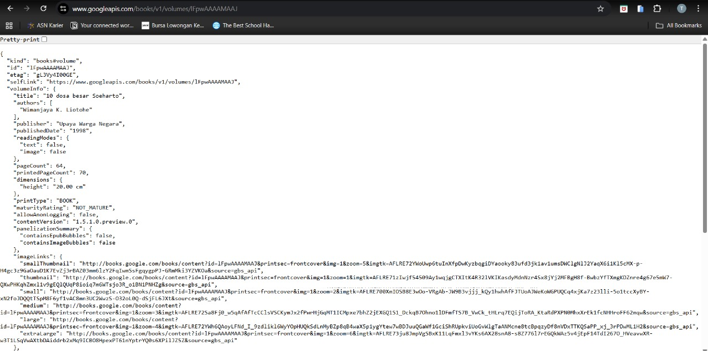
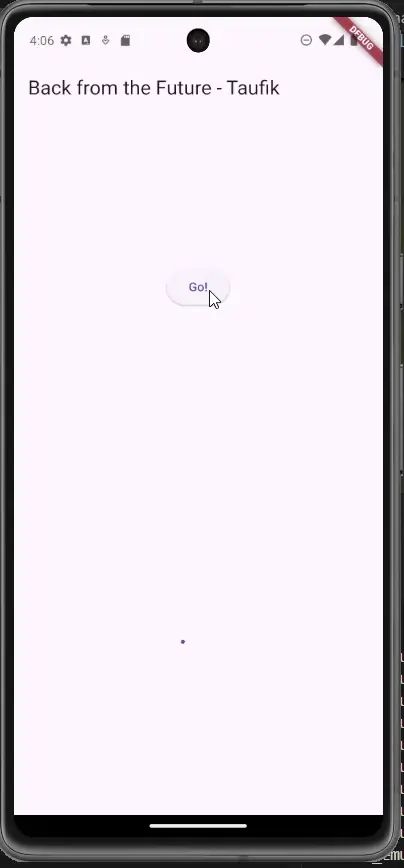
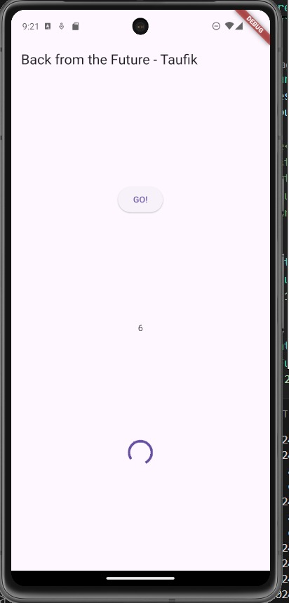
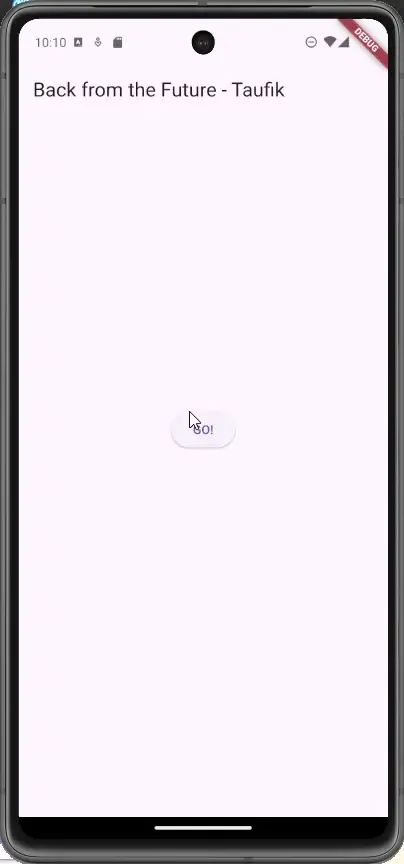
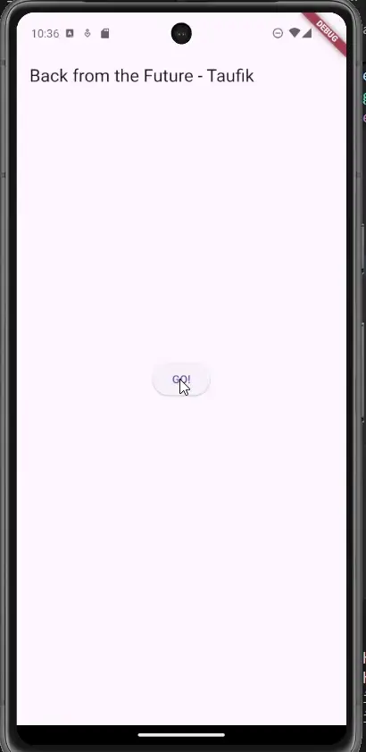
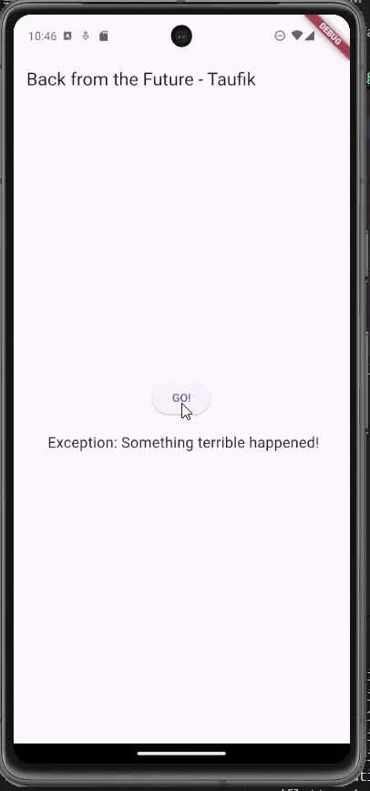
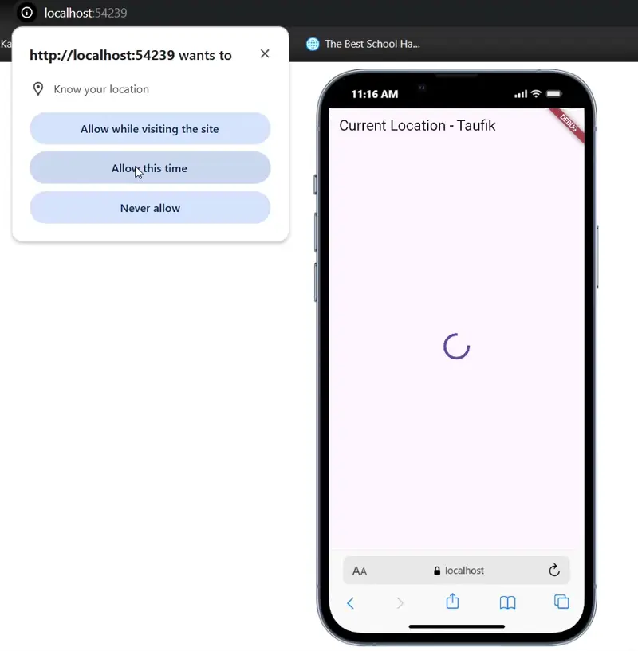

# Praktikum 1: Mengunduh Data dari Web Service (API)

## Langkah 1: Buat Project Baru

Buatlah sebuah project flutter baru dengan nama books di folder src week-11 repository GitHub Anda.

Kemudian Tambahkan dependensi http dengan mengetik perintah berikut di terminal.

```shell
flutter pub add http
```

## Langkah 2: Cek file pubspec.yaml

```dart
dependencies:
  flutter:
    sdk: flutter
  http: ^1.1.0
```

## Langkah 3: Buka file main.dart

Ketiklah kode seperti berikut ini.

### Soal 1

Tambahkan nama panggilan Anda pada title app sebagai identitas hasil pekerjaan Anda.

```dart
import 'package:flutter/material.dart';

void main() {
  runApp(const MyApp());
}

class MyApp extends StatelessWidget {
  const MyApp({super.key});

  @override
  Widget build(BuildContext context) {
    return MaterialApp(
      title: 'Buku Taufik',
      theme: ThemeData(
        primarySwatch: Colors.blue,
        visualDensity: VisualDensity.adaptivePlatformDensity,
      ),
      home: const FuturePage(),
    );
  }
}

class FuturePage extends StatefulWidget {
  const FuturePage({super.key});

  @override
  State<FuturePage> createState() => _FuturePageState();
}

class _FuturePageState extends State<FuturePage> {
  String result = '';
  @override
  Widget build(BuildContext context) {
    return Scaffold(
      appBar: AppBar(title: const Text('Back from the Future - Taufik')),
      body: Center(
        child: Column(
          children: [
            const Spacer(),
            ElevatedButton(onPressed: () {}, child: Text('Go!')),
            const Spacer(),
            Text(result),
            const Spacer(),
            const CircularProgressIndicator(),
            const Spacer(),
          ],
        ),
      ),
    );
  }
}
```

## Langkah 4: Tambah method getData()

Tambahkan method ini ke dalam class \_FuturePageState yang berguna untuk mengambil data dari API Google Books.

### Soal 2

- Carilah judul buku favorit Anda di Google Books, lalu ganti ID buku pada variabel path di kode tersebut. Caranya ambil di URL browser Anda seperti gambar berikut ini.
- Kemudian cobalah akses di browser URI tersebut dengan lengkap seperti ini. Jika menampilkan data JSON, maka Anda telah berhasil. Lakukan capture milik Anda dan tulis di README pada laporan praktikum. Lalu lakukan commit dengan pesan "W11: Soal 2".

- Link: https://www.google.co.id/books/edition/10_dosa_besar_Soeharto/lFpwAAAAMAAJ?hl=en&gbpv=0&bsq=10%20dosa%20besar%20soeharto

- Kode unik: `lFpwAAAAMAAJ`
- Di dalam method getData() pada main.dart, ganti ID buku yang ada `lFpwAAAAMAAJ` dengan ID buku yang baru.

  ```dart
  Future<Response> getData() async {
    const authority = 'www.googleapis.com';
    const path = '/books/v1/volumes/lFpwAAAAMAAJ';
    Uri url = Uri.https(authority, path);
    return http.get(url);


  }
  ```

- Hasil google apis https://www.googleapis.com/books/v1/volumes/lFpwAAAAMAAJ
  

## Langkah 5: Tambah kode di ElevatedButton

Tambahkan kode pada onPressed di ElevatedButton seperti berikut.

```dart
ElevatedButton(
  onPressed: () {
    setState(() {});
    getData()
        .then((value) {
          result = value.body.toString().substring(0, 450);
          setState(() {});
        })
        .catchError((_) {
          result = 'An error occurred';
          setState(() {});
        });
  },
  child: Text('Go!'),
),
```

### Soal 3

- Jelaskan maksud kode langkah 5 tersebut terkait substring dan catchError!

  - substring(0, 450)\
    Potongan kode ini berfungsi mengambil hanya sebagian kecil dari teks yang diperoleh melalui value.body, tepatnya dari karakter pertama hingga ke-450. Dengan begitu, data yang ditampilkan pada variabel result hanyalah ringkasan singkat, bukan keseluruhan isi respons. Hal ini mencegah widget Text menampilkan teks yang terlalu panjang dan tetap menjaga tampilan aplikasi lebih rapi serta mudah dibaca.

  - catchError((\_) { … })\
    Bagian ini bertugas sebagai penanganan kesalahan (error handling). Jika terjadi masalah saat proses getData() atau ketika eksekusi lanjutan di dalam then (misalnya pemanggilan substring gagal karena isi teks kosong atau jumlah karakternya kurang dari 450), blok catchError akan dijalankan. Dalam kondisi tersebut, variabel result akan diisi dengan pesan standar seperti 'An error occurred', lalu setState dipanggil agar tampilan aplikasi segera diperbarui sesuai kondisi error tersebut.

- Capture hasil praktikum Anda berupa GIF dan lampirkan di README. Lalu lakukan commit dengan pesan "W11: Soal 3".
  

# Praktikum 2: Menggunakan await/async untuk menghindari callbacks

## Langkah 1: Buka file main.dart

Tambahkan tiga method berisi kode seperti berikut di dalam class \_FuturePageState.

```dart
Future<int> returnOneAsync() async {
  await Future.delayed(const Duration(seconds: 3));
  return 1;
}

Future<int> returnTwoAsync() async {
  await Future.delayed(const Duration(seconds: 3));
  return 2;
}

Future<int> returnThreeAsync() async {
  await Future.delayed(const Duration(seconds: 3));
  return 3;
}
```

## Langkah 2: Tambah method count()

Lalu tambahkan lagi method ini di bawah ketiga method sebelumnya.

```dart
Future count() async {
  int total = 0;
  total = await returnOneAsync();
  total += await returnTwoAsync();
  total += await returnThreeAsync();
  setState(() {
    result = total.toString();
  });
}
```

## Langkah 3: Panggil count()

Lakukan comment kode sebelumnya, ubah isi kode onPressed() menjadi seperti berikut.

```dart
ElevatedButton(
  child: Text('GO!'),
  onPressed: () {
    count();
  },
)
```

## Langkah 4: Run

Akhirnya, run atau tekan F5 jika aplikasi belum running. Maka Anda akan melihat seperti gambar berikut, hasil angka 6 akan tampil setelah delay 9 detik.

### Soal 4

- Jelaskan maksud kode langkah 1 dan 2 tersebut!

  - Langkah 1 – membuat tiga method async\
     Pada tahap ini didefinisikan tiga buah metode asynchronous yang masing-masing mengembalikan objek Future<int>. Setiap metode dirancang untuk menghasilkan nilai konstan (1, 2, dan 3) setelah jeda waktu tertentu. Jeda tersebut diimplementasikan melalui pemanggilan await Future.delayed(Duration(seconds: 3)), yang berfungsi mensimulasikan proses komputasi atau operasi I/O yang memerlukan waktu eksekusi relatif lama. Dengan demikian, metode-metode ini berperan sebagai representasi tugas terjadwal yang dapat digunakan untuk mengilustrasikan perilaku penundaan (delay) dalam pemrograman asynchronous.

  - Langkah 2 – method count()\
    Metode count() digunakan untuk mendemonstrasikan pola eksekusi sekuensial pada operasi asynchronous. Proses dimulai dengan inisialisasi variabel total = 0. Selanjutnya:
    - Pemanggilan returnOneAsync() menunggu selama 3 detik, kemudian menghasilkan nilai 1 yang ditambahkan ke dalam total sehingga total = 1.
    - Setelah itu, returnTwoAsync() dijalankan dengan mekanisme serupa, menunggu 3 detik dan mengembalikan nilai 2, sehingga total = 3.
    - Terakhir, returnThreeAsync() kembali menunggu 3 detik dan mengembalikan nilai 3, sehingga total = 6.
      Secara keseluruhan, proses ini memerlukan waktu kurang lebih sembilan detik sebelum hasil akhir diperoleh.
      Setelah seluruh tahapan selesai, metode setState() dipanggil untuk memperbarui antarmuka pengguna dengan nilai akhir tersebut.

- Capture hasil praktikum Anda berupa GIF dan lampirkan di README. Lalu lakukan commit dengan pesan "W11: Soal 4".

  - Hasil:\
    

# Praktikum 3: Menggunakan Completer di Future

## Langkah 1: Buka main.dart

Pastikan telah impor package async berikut.

```dart
import 'package:async/async.dart';
```

## Langkah 2: Tambahkan variabel dan method

Tambahkan variabel late dan method di class \_FuturePageState seperti ini.

```dart
late Completer completer;

Future getNumber() {
  completer = Completer<int>();
  calculate();
  return completer.future;
}

Future calculate() async {
  await Future.delayed(const Duration(seconds: 5));
  completer.complete(42);
}
```

## Langkah 3: Ganti isi kode onPressed()

Tambahkan kode berikut pada fungsi onPressed(). Kode sebelumnya bisa Anda comment.

```dart
getNumber().then((value) {
  setState(() {
    result = value.toString();
  });
});
```

## Langkah 4:

Terakhir, run atau tekan F5 untuk melihat hasilnya jika memang belum running. Bisa juga lakukan hot restart jika aplikasi sudah running. Maka hasilnya akan seperti gambar berikut ini. Setelah 5 detik, maka angka 42 akan tampil.

## Langkah 5: Ganti method calculate()

Gantilah isi code method calculate() seperti kode berikut, atau Anda dapat membuat calculate2()

```dart
Future calculate() async {
  try {
    await Future.delayed(const Duration(seconds: 5));
    completer.complete(42);
  } catch (e) {
    completer.completeError(e);
  }
}
```

### Soal 5

- Jelaskan maksud kode langkah 2 tersebut!

  - late Completer completer;\
    Deklarasi ini berfungsi sebagai penampung sebuah Completer yang nantinya akan digunakan untuk menyelesaikan (complete) sebuah Future<int> secara manual. Dengan kata lain, variabel ini menjadi penghubung antara proses asynchronous dan nilai akhir yang akan diberikan.

  - getNumber()\
    Metode ini membuat objek Completer<int> baru. Setelah itu, ia langsung memanggil fungsi calculate() tanpa menunggu hasilnya (tanpa await). Karena itu, eksekusi tidak tertahan selama 5 detik. Fungsi ini segera mengembalikan completer.future kepada pemanggil, sehingga pemanggil memperoleh sebuah Future yang masih dalam status “belum selesai” dan akan terisi nilainya di kemudian waktu.

  - calculate()\
    Fungsi ini menjalankan simulasi proses yang memerlukan waktu dengan menunggu selama 5 detik. Setelah penundaan tersebut, ia memanggil completer.complete(42). Pada saat inilah Future yang sebelumnya dikembalikan oleh getNumber() dianggap selesai, dengan nilai akhir berupa angka 42.

- Capture hasil praktikum Anda berupa GIF dan lampirkan di README. Lalu lakukan commit dengan pesan "W11: Soal 5".
  Hasil:\
  

## Langkah 6: Pindah ke onPressed()

Ganti menjadi kode seperti berikut.

```dart
getNumber()
.then((value) {
  setState(() {
    result = value.toString();
  });
})
.catchError((e) {
  result = 'An error occurred';
});
```

### Soal 6

- Jelaskan maksud perbedaan kode langkah 2 dengan langkah 5-6 tersebut!

  - Perbedaan dengan langkah sebelumnya adalah penambahan penanganan error menggunakan .catchError(), sehingga aplikasi dapat menangani kondisi error dengan baik.

- Capture hasil praktikum Anda berupa GIF dan lampirkan di README. Lalu lakukan commit dengan pesan "W11: Soal 6".
  Hasil:\
   

# Praktikum 4: Memanggil Future secara paralel

Library:

Ketika Anda membutuhkan untuk menjalankan banyak Future secara bersamaan, ada sebuah class yang dapat Anda gunakan yaitu: FutureGroup.

FutureGroup tersedia di package async, yang mana itu harus diimpor ke file dart Anda, seperti berikut.

```shell
flutter pub add async
```

## Langkah 1: Buka file main.dart

Tambahkan method ini ke dalam class \_FuturePageState

```dart
Future returnFG() async {
  FutureGroup<int> futureGroup = FutureGroup<int>();
  futureGroup.add(returnOneAsync());
  futureGroup.add(returnTwoAsync());
  futureGroup.add(returnThreeAsync());
  futureGroup.close();
  final futures = await futureGroup.future;
  int total = 0;
  for (var num in futures) {
    total += num;
  }
  setState(() {
    result = total.toString();
  });
}
```

## Langkah 2: Edit onPressed()

Anda bisa hapus atau comment kode sebelumnya, kemudian panggil method dari langkah 1 tersebut.

```dart
ElevatedButton(
            onPressed: () {
              returnFG();
              // getNumber()
            }
)
```

## Langkah 3: Run

Anda akan melihat hasilnya dalam 3 detik berupa angka 6 lebih cepat dibandingkan praktikum sebelumnya menunggu sampai 9 detik.

### Soal 7

Capture hasil praktikum Anda berupa GIF dan lampirkan di README. Lalu lakukan commit dengan pesan "W11: Soal 7".



## Langkah 4: Ganti variabel futureGroup

Anda dapat menggunakan FutureGroup dengan Future.wait seperti kode berikut.

```dart
final futures = Future.wait<int>([
  returnOneAsync(),
  returnTwoAsync(),
  returnThreeAsync(),
]);
```

### Soal 8

Jelaskan maksud perbedaan kode langkah 1 dan 4!

- Future.wait([...])

  - Merupakan fitur bawaan bahasa Dart yang secara langsung dapat menunggu sejumlah Future sekaligus.
  - Mekanismenya akan mengeksekusi seluruh Future yang diberikan, lalu mengembalikan sebuah List<T> berisi hasil dari masing-masing Future setelah semuanya selesai.
  - Penulisan kode menjadi ringkas dan idiomatis.
  - Dengan pendekatan ini, pengembang tidak perlu membuat struktur tambahan untuk mengelola kumpulan Future.

- FutureGroup (dari paket async)

  - Berbeda dengan Future.wait, penggunaan FutureGroup mengharuskan pengembang membuat sebuah objek khusus terlebih dahulu.
  - Setiap Future yang ingin dipantau ditambahkan melalui metode .add(). Setelah semua Future dimasukkan, pemanggilan .close() menandai bahwa tidak ada lagi Future baru yang akan ditambahkan.
  - Hasil akhirnya baru dapat diperoleh melalui await futureGroup.future, yang akan menghasilkan List<T> setelah seluruh Future di dalam grup selesai.
  - Penulisan relatif lebih panjang. Pendekatan ini lebih umum digunakan pada masa sebelum Future.wait menjadi praktik standar, terutama ketika diperlukan fleksibilitas untuk menambahkan Future secara dinamis sebelum akhirnya ditutup.

# Praktikum 5: Menangani Respon Error pada Async Code

## Langkah 1: Buka file main.dart

Tambahkan method ini ke dalam class \_FuturePageState

```dart
Future<int> returnError() async {
  await Future.delayed(const Duration(seconds: 2));
  throw Exception('Something terrible happened!');
}
```

## Langkah 2: ElevatedButton

Ganti dengan kode berikut

```dart
returnError()
    .then((value) {
      setState(() {
        result = 'Success';
      });
    })
    .catchError((onError) {
      setState(() {
        result = onError.toString();
      });
    })
    .whenComplete(() => print('Complete'));
```

## Langkah 3: Run

Lakukan run dan klik tombol GO! maka akan menghasilkan seperti gambar berikut.

### Soal 9

Capture hasil praktikum Anda berupa GIF dan lampirkan di README. Lalu lakukan commit dengan pesan "W11: Soal 9".



## Langkah 4: Tambah method handleError()

Tambahkan kode ini di dalam class \_FutureStatePage

### Soal 10

Panggil method handleError() tersebut di ElevatedButton, lalu run. Apa hasilnya? Jelaskan perbedaan kode langkah 1 dan 4!

Jawab: Kedua pendekatan menghasilkan output yang sama - menampilkan pesan error "Exception: Something terrible happened!" dan mencetak 'Complete' di console. Namun handleError() dengan try-catch lebih mudah dibaca dan dipelihara.

# Praktikum 6: Menggunakan Future dengan StatefulWidget

## Langkah 1: install plugin geolocator

Tambahkan plugin geolocator dengan mengetik perintah berikut di terminal.

```dart
flutter pub add geolocator
```

## Langkah 2: Tambah permission GPS

Jika Anda menargetkan untuk platform Android, maka tambahkan baris kode berikut di file android/app/src/main/androidmanifest.xml

```xml
<uses-permission android:name="android.permission.ACCESS_FINE_LOCATION"/>
<uses-permission android:name="android.permission.ACCESS_COARSE_LOCATION"/>
```

Jika Anda menargetkan untuk platform iOS, maka tambahkan kode ini ke file Info.plist

```xml
<key>NSLocationWhenInUseUsageDescription</key>
<string>This app needs to access your location</string>
```

## Langkah 3: Buat file geolocation.dart

Tambahkan file baru ini di folder lib project Anda.
Langkah 4: Buat StatefulWidget

Buat class LocationScreen di dalam file geolocation.dart

## Langkah 5: Isi kode geolocation.dart

### Soal 11

Tambahkan nama panggilan Anda pada tiap properti title sebagai identitas pekerjaan Anda.

```dart
import 'package:flutter/material.dart';
import 'package:geolocator/geolocator.dart';

class LocationScreen extends StatefulWidget {
  const LocationScreen({super.key});

  @override
  State<LocationScreen> createState() => _LocationScreenState();
}

class _LocationScreenState extends State<LocationScreen> {
  String myPosition = "";

  @override
  void initState() {
    super.initState();
    getPosition().then((Position myPos) {
      myPosition =
          'latitude: ${myPos.latitude.toString()} - Longitude: ${myPos.longitude.toString()}';
      setState(() {
        myPosition = myPosition;
      });
    });
  }

  @override
  Widget build(BuildContext context) {
    return Scaffold(
      appBar: AppBar(title: const Text('Current Location - Taufik')),
      body: Center(child: Text(myPosition)),
    );
  }

  Future<Position> getPosition() async {
    await Geolocator.requestPermission();
    await Geolocator.isLocationServiceEnabled();
    Position? position = await Geolocator.getCurrentPosition();
    return position;
  }
}
```

## Langkah 6: Edit main.dart

Panggil screen baru tersebut di file main Anda seperti berikut.

```dart
home: LocationScreen(),
```

## Langkah 7: Run

Run project Anda di device atau emulator (bukan browser), maka akan tampil seperti berikut ini.


## Langkah 8: Tambahkan animasi loading

Tambahkan widget loading seperti kode berikut. Lalu hot restart, perhatikan perubahannya.

### Soal 12

- Jika Anda tidak melihat animasi loading tampil, kemungkinan itu berjalan sangat cepat. Tambahkan delay pada method getPosition() dengan kode await Future.delayed(const Duration(seconds: 3));

  ```dart
  Future<Position> getPosition() async {
    await Geolocator.requestPermission();
    await Geolocator.isLocationServiceEnabled();
    await Future.delayed(const Duration(seconds: 1));
    Position? position = await Geolocator.getCurrentPosition();
    return position;
  }
  ```

- Apakah Anda mendapatkan koordinat GPS ketika run di browser? Mengapa demikian?

  - Saya mendapatkan Koordinat GPS saat menjalankan pada browser Google Chrome:
    

# Praktikum 7: Manajemen Future dengan FutureBuilder

## Langkah 1: Modifikasi method getPosition()

Buka file geolocation.dart kemudian ganti isi method dengan kode ini.

```dart
Future<Position> getPosition() async {
  await Geolocator.requestPermission();
  await Geolocator.isLocationServiceEnabled();
  await Future.delayed(const Duration(seconds: 1));
  Position? position = await Geolocator.getCurrentPosition();
  return position;
}
```

## Langkah 2: Tambah variabel

Tambah variabel ini di class \_LocationScreenState

```dart
Future<Position>? position;
```

## Langkah 3: Tambah initState()

Tambah method ini dan set variabel position

```dart
@override
void initState() {
  super.initState();
  position = getPosition();
}
```

## Langkah 4: Edit method build()

Ketik kode berikut dan sesuaikan. Kode lama bisa Anda comment atau hapus.

```dart
@override
Widget build(BuildContext context) {
  return Scaffold(
    appBar: AppBar(title: Text('Current Location - Taufik')),
    body: Center(
      child: FutureBuilder<Position>(
        future: position,
        builder: (BuildContext context, AsyncSnapshot<Position> snapshot) {
          if (snapshot.connectionState == ConnectionState.waiting) {
            return const CircularProgressIndicator();
          } else if (snapshot.connectionState == ConnectionState.done) {
            return Text(snapshot.data.toString());
          } else if (snapshot.hasError) {
            return Text('Error: ${snapshot.error}');
          } else {
            return const Text('');
          }
        },
      ),
    ),
  );
}
```

### Soal 13

- Apakah ada perbedaan UI dengan praktikum sebelumnya? Mengapa demikian?

  - Tidak ada perbedaan UI karena functionality-nya sama, hanya cara implementasinya yang lebih baik dengan FutureBuilder.

- Capture hasil praktikum Anda berupa GIF dan lampirkan di README. Lalu lakukan commit dengan pesan "W11: Soal 13".\
   

- Seperti yang Anda lihat, menggunakan FutureBuilder lebih efisien, clean, dan reactive dengan Future bersama UI.

## Langkah 5: Tambah handling error

Tambahkan kode berikut untuk menangani ketika terjadi error. Kemudian hot restart.

```dart
...
} else if (snapshot.hasError) {
  return Text('Error: ${snapshot.error}');
} else {
```

### Soal 14

- Apakah ada perbedaan UI dengan langkah sebelumnya? Mengapa demikian?

  - Tidak ada perbedaan UI visual, tapi sekarang aplikasi lebih siap menangani error dengan menampilkan pesan error jika terjadi masalah saat mengambil lokasi.

# Praktikum 8: Navigation route dengan Future Function

## Langkah 1: Buat file baru navigation_first.dart

Buatlah file baru ini di project lib Anda.

## Langkah 2: Isi kode navigation_first.dart

### Soal 15

- Tambahkan nama panggilan Anda pada tiap properti title sebagai identitas pekerjaan Anda.
- Silakan ganti dengan warna tema favorit Anda.

```dart
import 'package:books/navigation_second.dart';
import 'package:flutter/material.dart';

class NavigationFirst extends StatefulWidget {
  const NavigationFirst({super.key});

  @override
  State<NavigationFirst> createState() => _NavigationFirstState();
}

class _NavigationFirstState extends State<NavigationFirst> {
  Color color = Colors.blue.shade700;

  @override
  Widget build(BuildContext context) {
    return Scaffold(
      backgroundColor: color,
      appBar: AppBar(title: const Text('Navigation First Screen - Taufik')),
      body: Center(
        child: ElevatedButton(
          child: const Text('Change Color'),
          onPressed: () {
            _navigateAndGetColor(context);
          },
        ),
      ),
    );
  }
}
```

## Langkah 3: Tambah method di class \_NavigationFirstState

Tambahkan method ini.

```dart
Future _navigateAndGetColor(BuildContext context) async {
  color =
      await Navigator.push(
        context,
        MaterialPageRoute(builder: (context) => const NavigationSecond()),
      ) ??
      Colors.blue;
  setState(() {});
}
```

## Langkah 4: Buat file baru navigation_second.dart

Buat file baru ini di project lib Anda. Silakan jika ingin mengelompokkan view menjadi satu folder dan sesuaikan impor yang dibutuhkan.

## Langkah 5: Buat class NavigationSecond dengan StatefulWidget

```dart
import 'package:flutter/material.dart';

class NavigationSecond extends StatefulWidget {
  const NavigationSecond({super.key});

  @override
  State<NavigationSecond> createState() => _NavigationSecondState();
}

class _NavigationSecondState extends State<NavigationSecond> {
  @override
  Widget build(BuildContext context) {
    Color color;
    return Scaffold(
      appBar: AppBar(title: const Text('Navigation Second Screen - Taufik')),
      body: Center(
        child: Column(
          mainAxisAlignment: MainAxisAlignment.spaceEvenly,
          children: [
            ElevatedButton(
              child: const Text('Purple'),
              onPressed: () {
                color = Colors.purple.shade700;
                Navigator.pop(context, color);
              },
            ),
            ElevatedButton(
              child: const Text('Orange'),
              onPressed: () {
                color = Colors.orange.shade700;
                Navigator.pop(context, color);
              },
            ),
            ElevatedButton(
              child: const Text('Teal'),
              onPressed: () {
                color = Colors.teal.shade700;
                Navigator.pop(context, color);
              },
            ),
          ],
        ),
      ),
    );
  }
}
```

## Langkah 6: Edit main.dart

Lakukan edit properti home.

```dart
home: const NavigationFirst(),
```

## Langkah 7: Run

Lakukan run, jika terjadi error silakan diperbaiki.

### Soal 16

- Cobalah klik setiap button, apa yang terjadi ? Mengapa demikian ?

  - Halaman 1 (NavigationFirst): Menampilkan background dengan warna Teal Ada tombol "Change Color"
    Saat tekan "Change Color": Navigator.push() membuka halaman kedua Method menunggu (await) hasil dari halaman kedua

  - Halaman 2 (NavigationSecond): Menampilkan 3 tombol warna: Purple, Orange, Teal
    Saat pilih warna, Navigator.pop(context, color) menutup halaman dan mengembalikan warna sebagai hasil Future

  - Kembali ke Halaman 1: Menerima warna dari Future Update variabel color dengan warna yang dipilih
    Panggil setState() untuk refresh UI Background berubah sesuai warna pilihan

        Konsep Future pada Navigation:
        Navigator.push() mengembalikan Future yang akan complete ketika halaman kedua di-pop dengan Navigator.pop(context, result). Ini memungkinkan passing data dari halaman child ke parent melalui navigation.

- Gantilah 3 warna pada langkah 5 dengan warna favorit Anda!

  - Colors.Purple
  - Colors.orange
  - Colors.Teal

- Capture hasil praktikum Anda berupa GIF dan lampirkan di README. Lalu lakukan commit dengan pesan "W11: Soal 16".\
  

# Praktikum 9: Memanfaatkan async/await dengan Widget Dialog

## Langkah 1: Buat file baru navigation_dialog.dart

Buat file dart baru di folder lib project Anda.

## Langkah 2: Isi kode navigation_dialog.dart

```dart
import 'package:flutter/material.dart';

class NavigationDialogScreen extends StatefulWidget {
  const NavigationDialogScreen({super.key});

  @override
  State<NavigationDialogScreen> createState() =>
      _NavigationDialogScreenState();
}

class _NavigationDialogScreenState extends State<NavigationDialogScreen> {
  Color color = Colors.indigo.shade700;

  @override
  Widget build(BuildContext context) {
    return Scaffold(
      backgroundColor: color,
      appBar: AppBar(title: const Text('Navigation Dialog Screen - Taufik')),
      body: Center(
        child: ElevatedButton(
          child: const Text('Change Color'),
          onPressed: () {
            _showColorDialog(context).then((value) => setState(() {}));
          },
        ),
      ),
    );
  }
```

## Langkah 3: Tambah method async

```dart
_showColorDialog(BuildContext context) async {
    await showDialog(
      barrierDismissible: false,
      context: context,
      builder: (_) {
        return AlertDialog(
          title: const Text('Very important question'),
          content: const Text('Please choose a color'),
          actions: <Widget>[
            TextButton(
              child: const Text('Amber'),
              onPressed: () {
                color = Colors.amber.shade700;
                Navigator.pop(context, color);
              },
            ),
            TextButton(
              child: const Text('Cyan'),
              onPressed: () {
                color = Colors.cyan.shade700;
                Navigator.pop(context, color);
              },
            ),
            TextButton(
              child: const Text('Indigo'),
              onPressed: () {
                color = Colors.indigo.shade700;
                Navigator.pop(context, color);
              },
            ),
          ],
        );
      },
    );
  }
}
```

## Langkah 4: Panggil method di ElevatedButton

```dart
onPressed: () {
  _showColorDialog(context).then((value) => setState(() {}));
},
```

## Langkah 5: Edit main.dart

Ubah properti home

```dart
home: const NavigationDialogScreen(),
```

## Langkah 6: Run

Coba ganti warna background dengan widget dialog tersebut. Jika terjadi error, silakan diperbaiki. Jika berhasil, akan tampil seperti gambar berikut.

### Soal 17

- Cobalah klik setiap button, apa yang terjadi ? Mengapa demikian ?

  - Tampilan awal: Background berwarna Indigo, Ada tombol "Change Color"
  - Saat tekan "Change Color":showDialog() menampilkan AlertDialog (pop-up)
    Dialog menampilkan 3 pilihan warna: Amber, Cyan, Indigo
  - User tidak bisa menutup dialog dengan tap di luar (barrierDismissible: false)
  - Saat pilih warna: Variabel color diupdate dengan warna yang dipilih
  - Navigator.pop(context, color) menutup dialog dan mengembalikan warna sebagai hasil Future
  - .then() dipanggil setelah dialog tertutup
  - setState() memperbarui UI
  - Background berubah sesuai warna yang dipilih

  ## Perbedaan dengan Praktikum 8:

  Praktikum 8: Navigasi ke halaman baru (full screen)

  Praktikum 9: Menampilkan dialog (overlay) dengan async/await

- Gantilah 3 warna pada langkah 3 dengan warna favorit Anda!

  - Colors.amber
  - Colors.cyan
  - Colors.indigo

- Capture hasil praktikum Anda berupa GIF dan lampirkan di README. Lalu lakukan commit dengan pesan "W11: Soal 17".\
   
