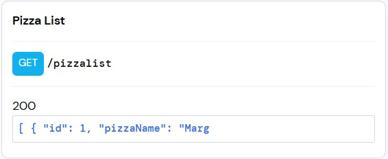
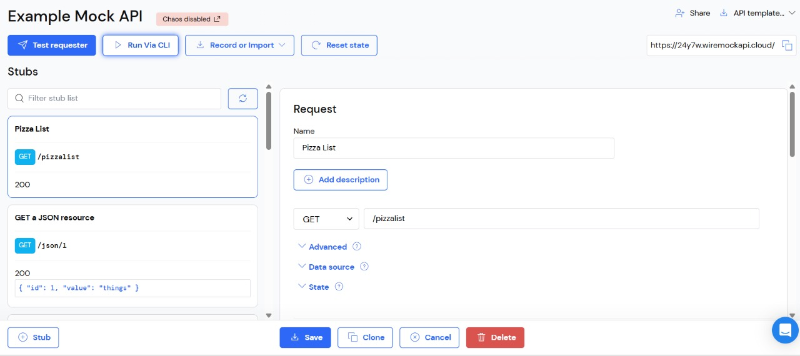
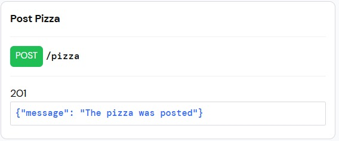
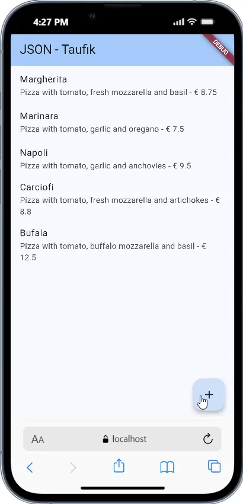
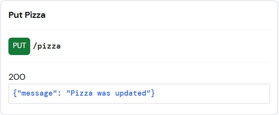
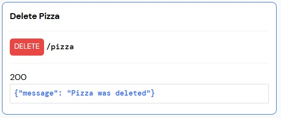
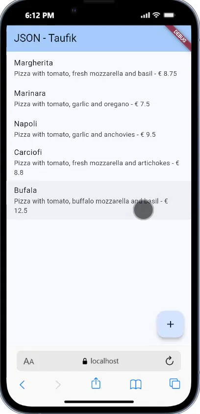

# Week 14 - RESTful API

**Nama:** Taufik Dimas Pramudya  
**NIM:** 2341720062  
**Kelas:** TI-3H

---

## Praktikum 1: Membuat layanan Mock API

## Praktikum 1: Membuat layanan Mock API

### Langkah 1-4: Setup Mock API

1. Daftar ke [WireMock Cloud](https://app.wiremock.cloud/)
2. Buka "Example Mock API" dan klik bagian Stubs
3. Buat stub baru dengan nama "Pizza List", verb GET, path `/pizza`
4. Copy data JSON dari [https://bit.ly/pizzalist](https://bit.ly/pizzalist) dan paste ke Response body



### Langkah 5: Tambahkan dependensi http

```bash
flutter pub add http
```

### Langkah 6: Buat file httphelper.dart

Buat file `lib/httphelper.dart` dengan kode HttpHelper class yang mengimplementasikan singleton pattern.

### Langkah 7: Buat Model Pizza

Buat file `lib/model/pizza.dart` dengan class Pizza dan constructor fromJson.

### Langkah 8: Update main.dart

Tambahkan method `callPizzas()` di class `_MyHomePageState`:

```dart
Future<List<Pizza>> callPizzas() async {
  HttpHelper helper = HttpHelper();
  List<Pizza> pizzas = await helper.getPizzaList();
  return pizzas;
}
```

### Langkah 9: Tambahkan FutureBuilder

Update method build() untuk menggunakan FutureBuilder yang menampilkan ListView dari data pizza.

### Soal 1

**Tugas:**

1. ✅ Tambahkan nama panggilan pada title app sebagai identitas hasil pekerjaan
2. ✅ Gantilah warna tema aplikasi sesuai kesukaan
3. ✅ Implementasikan singleton pattern pada HttpHelper class

**Implementasi:**

**1. Title App dengan Nama Panggilan:**

```dart
class MyApp extends StatelessWidget {
  const MyApp({super.key});

  @override
  Widget build(BuildContext context) {
    return MaterialApp(
      title: 'JSON - Taufik',
      theme: ThemeData(
        colorScheme: ColorScheme.fromSeed(seedColor: Colors.blue),
      ),
      home: const MyHomePage(),
    );
  }
}
```

**2. Singleton Pattern pada HttpHelper:**

```dart
class HttpHelper {
  // Singleton pattern
  static final HttpHelper _httpHelper = HttpHelper._internal();
  HttpHelper._internal();
  factory HttpHelper() {
    return _httpHelper;
  }

  final String authority = '24y7w.wiremockapi.cloud';
  final String path = 'pizza';

  Future<List<Pizza>> getPizzaList() async {
    final Uri url = Uri.https(authority, path);
    final http.Response result = await http.get(url);
    if (result.statusCode == HttpStatus.ok) {
      final jsonResponse = json.decode(result.body);
      List<Pizza> pizzas =
          jsonResponse.map<Pizza>((i) => Pizza.fromJson(i)).toList();
      return pizzas;
    } else {
      return [];
    }
  }
}
```

**Penjelasan Singleton Pattern:**

- `static final HttpHelper _httpHelper = HttpHelper._internal();` - Membuat instance tunggal yang bersifat static
- `HttpHelper._internal();` - Constructor private yang hanya bisa dipanggil dari dalam class
- `factory HttpHelper()` - Factory constructor yang selalu mengembalikan instance yang sama

Dengan pattern ini, setiap kali kita membuat `HttpHelper()`, kita selalu mendapatkan instance yang sama, menghemat memori dan resource.

**3. Screenshot Hasil:**



_Aplikasi berhasil menampilkan daftar pizza dari Mock API dengan nama dan harga masing-masing pizza._

**Commit:** `W14: Jawaban Soal 1`

---

## Praktikum 2: Mengirim Data ke Web Service (POST)

### Langkah 1-3: Setup Mock API untuk POST

1. Login ke [WireMock Cloud](https://app.wiremock.cloud/)
2. Buat stub baru dengan konfigurasi:
   - Nama: Post Pizza
   - Verb: POST
   - Path: `/pizza`
   - Status: 201
   - Body Type: json
   - Body: `{"message": "The pizza was posted"}`
3. Simpan stub



### Langkah 4: Tambahkan method postPizza di HttpHelper

```dart
Future<String> postPizza(Pizza pizza) async {
  const postPath = '/pizza';
  String post = json.encode(pizza.toJson());
  Uri url = Uri.https(authority, postPath);
  http.Response r = await http.post(
    url,
    body: post,
  );
  return r.body;
}
```

### Langkah 5-12: Buat PizzaDetailScreen

Buat file `lib/pizza_detail.dart` yang berisi:

- TextEditingController untuk ID, Name, Description, Price, ImageUrl
- Form untuk input data pizza
- Button untuk mengirim POST request
- Tampilan hasil operasi POST

### Langkah 13-14: Update main.dart

Tambahkan FloatingActionButton untuk navigasi ke PizzaDetailScreen:

```dart
floatingActionButton: FloatingActionButton(
  child: const Icon(Icons.add),
  onPressed: () {
    Navigator.push(
      context,
      MaterialPageRoute(
        builder: (context) => const PizzaDetailScreen(),
      ),
    );
  },
),
```

### Soal 2

**Tugas:**

1. ✅ Tambahkan field baru dalam JSON maupun POST ke Wiremock
2. ✅ Capture hasil aplikasi berupa GIF

**Implementasi:**

**1. Model Pizza dengan toJson():**

```dart
class Pizza {
  int id;
  String pizzaName;
  String description;
  double price;
  String imageUrl;

  Map<String, dynamic> toJson() {
    return {
      'id': id,
      'pizzaName': pizzaName,
      'description': description,
      'price': price,
      'imageUrl': imageUrl,
    };
  }
}
```

**2. Pizza Detail Screen:**
Screen ini menyediakan form untuk input data pizza baru dengan 5 field:

- ID (int)
- Pizza Name (String)
- Description (String)
- Price (double)
- Image URL (String)

Setelah user mengisi form dan menekan tombol "Send Post", aplikasi akan:

1. Membuat objek Pizza dari input user
2. Convert ke JSON menggunakan `toJson()`
3. Kirim POST request ke WireMock API
4. Menampilkan response dari server

**Screenshot Hasil:**



_Aplikasi berhasil mengirim data pizza baru ke server menggunakan POST request dan menampilkan response "The pizza was posted"._

**Commit:** `W14: Jawaban Soal 2`

---

## Praktikum 3: Memperbarui Data di Web Service (PUT)

### Langkah 1-3: Setup Mock API untuk PUT

1. Login ke [WireMock Cloud](https://app.wiremock.cloud/)
2. Buat stub baru dengan konfigurasi:
   - Nama: Put Pizza
   - Verb: PUT
   - Path: `/pizza`
   - Status: 200
   - Body Type: json
   - Body: `{"message": "Pizza was updated"}`
3. Simpan stub



### Langkah 4: Tambahkan method putPizza di HttpHelper

```dart
Future<String> putPizza(Pizza pizza) async {
  const putPath = '/pizza';
  String put = json.encode(pizza.toJson());
  Uri url = Uri.https(authority, putPath);
  http.Response r = await http.put(
    url,
    body: put,
  );
  return r.body;
}
```

### Langkah 5: Update PizzaDetailScreen Constructor

Tambahkan properti Pizza dan boolean isNew:

```dart
class PizzaDetailScreen extends StatefulWidget {
  final Pizza pizza;
  final bool isNew;

  const PizzaDetailScreen({
    super.key,
    required this.pizza,
    required this.isNew,
  });
}
```

### Langkah 6: Override initState

Jika bukan pizza baru, isi TextField dengan data pizza yang ada:

```dart
@override
void initState() {
  if (!widget.isNew) {
    txtId.text = widget.pizza.id.toString();
    txtName.text = widget.pizza.pizzaName;
    txtDescription.text = widget.pizza.description;
    txtPrice.text = widget.pizza.price.toString();
    txtImageUrl.text = widget.pizza.imageUrl;
  }
  super.initState();
}
```

### Langkah 7: Update method savePizza

Gunakan conditional untuk POST atau PUT:

```dart
Future savePizza() async {
  HttpHelper helper = HttpHelper();
  Pizza pizza = Pizza();
  pizza.id = int.tryParse(txtId.text) ?? 0;
  pizza.pizzaName = txtName.text;
  pizza.description = txtDescription.text;
  pizza.price = double.tryParse(txtPrice.text) ?? 0.0;
  pizza.imageUrl = txtImageUrl.text;

  final result = await (widget.isNew
      ? helper.postPizza(pizza)
      : helper.putPizza(pizza));

  setState(() {
    operationResult = result;
  });
}
```

### Langkah 8: Update ListTile di main.dart

Tambahkan onTap untuk navigasi dengan pizza yang dipilih:

```dart
return ListTile(
  title: Text(snapshot.data![position].pizzaName),
  subtitle: Text(
    snapshot.data![position].description +
        ' - € ' +
        snapshot.data![position].price.toString(),
  ),
  onTap: () {
    Navigator.push(
      context,
      MaterialPageRoute(
        builder: (context) => PizzaDetailScreen(
          pizza: snapshot.data![position],
          isNew: false,
        ),
      ),
    );
  },
);
```

### Langkah 9: Update FloatingActionButton

Pass Pizza baru dengan isNew true:

```dart
floatingActionButton: FloatingActionButton(
  child: const Icon(Icons.add),
  onPressed: () {
    Navigator.push(
      context,
      MaterialPageRoute(
        builder: (context) => PizzaDetailScreen(
          pizza: Pizza(),
          isNew: true,
        ),
      ),
    );
  },
),
```

### Soal 3

**Tugas:**

1. ✅ Ubah salah satu data dengan Nama dan NIM Anda
2. ✅ Perhatikan hasilnya di Wiremock
3. ✅ Capture hasil aplikasi berupa GIF

**Implementasi:**

**1. Fitur Edit Pizza:**
Aplikasi kini memiliki 2 mode:

- **Mode Tambah (isNew = true)**: Ketika user menekan FloatingActionButton (+), form kosong akan muncul dan menggunakan POST
- **Mode Edit (isNew = false)**: Ketika user tap pada ListTile pizza, form akan terisi dengan data pizza tersebut dan menggunakan PUT

**2. Perbedaan POST vs PUT:**

- **POST**: Mengirim data baru ke server (Create)
- **PUT**: Memperbarui data yang sudah ada di server (Update)

**3. Flow Update Pizza:**

1. User tap pizza dari list
2. PizzaDetailScreen terbuka dengan data pizza yang dipilih
3. User mengubah data (misalnya nama menjadi "Taufik - 2341720062")
4. User klik tombol "Save"
5. Aplikasi memanggil `putPizza()` karena `isNew = false`
6. Server response: "Pizza was updated"

**Screenshot Hasil:**


_Aplikasi berhasil memperbarui data pizza yang sudah ada menggunakan PUT request. Data pizza yang dipilih dari list dapat diedit dan disimpan kembali ke server._

**Commit:** `W14: Jawaban Soal 3`

---

## Praktikum 4: Menghapus Data dari Web Service (DELETE)

### Langkah 1-3: Setup Mock API untuk DELETE

1. Login ke [WireMock Cloud](https://app.wiremock.cloud/)
2. Buat stub baru dengan konfigurasi:
   - Nama: Delete Pizza
   - Verb: DELETE
   - Path: `/pizza`
   - Status: 200
   - Body Type: json
   - Body: `{"message": "Pizza was deleted"}`
3. Simpan stub



### Langkah 4: Tambahkan method deletePizza di HttpHelper

```dart
Future<String> deletePizza(int id) async {
  const deletePath = '/pizza';
  Uri url = Uri.https(authority, deletePath);
  http.Response r = await http.delete(url);
  return r.body;
}
```

### Langkah 5: Wrap ListTile dengan Dismissible

Di main.dart, refactor ListView.builder untuk menggunakan Dismissible widget:

```dart
return ListView.builder(
  itemCount: (snapshot.data == null) ? 0 : snapshot.data!.length,
  itemBuilder: (BuildContext context, int position) {
    return Dismissible(
      key: Key(position.toString()),
      onDismissed: (direction) {
        HttpHelper helper = HttpHelper();
        snapshot.data!.removeWhere(
          (element) => element.id == snapshot.data![position].id,
        );
        helper.deletePizza(snapshot.data![position].id);
      },
      child: ListTile(
        title: Text(snapshot.data![position].pizzaName),
        subtitle: Text(
          snapshot.data![position].description +
              ' - € ' +
              snapshot.data![position].price.toString(),
        ),
        onTap: () {
          Navigator.push(
            context,
            MaterialPageRoute(
              builder: (context) => PizzaDetailScreen(
                pizza: snapshot.data![position],
                isNew: false,
              ),
            ),
          );
        },
      ),
    );
  },
);
```

### Soal 4

**Tugas:**

1. ✅ Implementasi DELETE dengan swipe gesture
2. ✅ Capture hasil aplikasi berupa GIF

**Implementasi:**

**1. Dismissible Widget:**
Widget `Dismissible` memungkinkan user untuk menghapus item dari list dengan gesture swipe (geser kiri/kanan). Komponen utamanya:

- **key**: Unique identifier untuk setiap item (menggunakan position)
- **onDismissed**: Callback yang dipanggil saat item di-dismiss
- **child**: Widget yang akan di-wrap (ListTile)

**2. Delete Flow:**

1. User swipe pizza item ke kiri atau kanan
2. Item menghilang dari UI dengan animasi
3. `onDismissed` callback terpanggil
4. Data dihapus dari list lokal dengan `removeWhere()`
5. Method `deletePizza()` dipanggil untuk hapus dari server
6. Server response: "Pizza was deleted"

**3. Keuntungan Dismissible:**

- ✅ UX yang intuitif (gesture natural)
- ✅ Visual feedback dengan animasi
- ✅ Tidak perlu tombol delete tambahan
- ✅ Consistent dengan pattern mobile apps

**Screenshot Hasil:**



_Aplikasi berhasil menghapus data pizza menggunakan DELETE request dengan swipe gesture. Item pizza yang di-swipe akan menghilang dari list dan dihapus dari server._

**Commit:** `W14: Jawaban Soal 4`

---

## Summary

### CRUD Operations Implemented:

| Operation  | HTTP Method | Trigger                  | Endpoint |
| ---------- | ----------- | ------------------------ | -------- |
| **Create** | POST        | FloatingActionButton (+) | `/pizza` |
| **Read**   | GET         | Load halaman utama       | `/pizza` |
| **Update** | PUT         | Tap pada item pizza      | `/pizza` |
| **Delete** | DELETE      | Swipe item pizza         | `/pizza` |

### Key Concepts:

1. **Singleton Pattern**: Memastikan hanya ada satu instance HttpHelper
2. **FutureBuilder**: Menangani async data dari API
3. **Dismissible Widget**: Swipe-to-delete gesture
4. **JSON Serialization**: `fromJson()` dan `toJson()` untuk konversi data
5. **RESTful API**: Menggunakan HTTP verbs (GET, POST, PUT, DELETE)

---

**Selesai - Week 14: RESTful API** ✅
