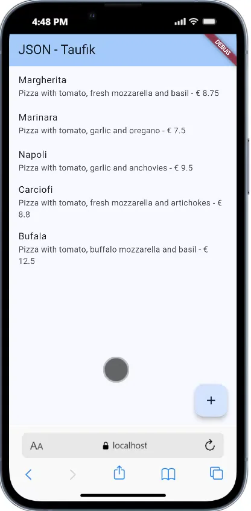

# Praktikum 1: Konversi Dart model ke JSON

Selesaikan langkah-langkah praktikum berikut ini menggunakan editor Visual Studio Code (VS Code) atau Android Studio atau code editor lain kesukaan Anda. Jawablah di laporan praktikum Anda (ketik di README.md) pada setiap soal yang ada di beberapa langkah praktikum ini.

---

# WEEK 14 - RESTful API

## Praktikum 1: Membuat layanan Mock API

### Langkah 1-4: Setup Mock API

1. Daftar ke [WireMock Cloud](https://app.wiremock.cloud/)
2. Buka "Example Mock API" dan klik bagian Stubs
3. Buat stub baru dengan nama "Pizza List", verb GET, path `/pizzalist`
4. Copy data JSON dari [https://bit.ly/pizzalist](https://bit.ly/pizzalist) dan paste ke Response body

### Langkah 5: Tambahkan dependensi http

```bash
flutter pub add http
```

### Langkah 6: Buat file httphelper.dart

Buat file `lib/httphelper.dart` dengan kode HttpHelper class yang mengimplementasikan singleton pattern.

### Langkah 7: Buat Model Pizza

Buat file `lib/model/pizza.dart` dengan class Pizza dan constructor fromJson.

### Langkah 8: Update main.dart

Tambahkan method `callPizzas()` di class `_MyHomePageState`:

```dart
Future<List<Pizza>> callPizzas() async {
  HttpHelper helper = HttpHelper();
  List<Pizza> pizzas = await helper.getPizzaList();
  return pizzas;
}
```

### Langkah 9: Tambahkan FutureBuilder

Update method build() untuk menggunakan FutureBuilder yang menampilkan ListView dari data pizza.

### Soal 1

**Tugas:**

1. ✅ Tambahkan nama panggilan pada title app sebagai identitas hasil pekerjaan
2. ✅ Gantilah warna tema aplikasi sesuai kesukaan
3. ✅ Implementasikan singleton pattern pada HttpHelper class

**Implementasi:**

**1. Title App dengan Nama Panggilan:**

```dart
class MyApp extends StatelessWidget {
  const MyApp({super.key});

  @override
  Widget build(BuildContext context) {
    return MaterialApp(
      title: 'JSON - Taufik',
      theme: ThemeData(
        colorScheme: ColorScheme.fromSeed(seedColor: Colors.blue),
      ),
      home: const MyHomePage(),
    );
  }
}
```

**2. Singleton Pattern pada HttpHelper:**

```dart
class HttpHelper {
  // Singleton pattern
  static final HttpHelper _httpHelper = HttpHelper._internal();
  HttpHelper._internal();
  factory HttpHelper() {
    return _httpHelper;
  }

  final String authority = '02z2g.mocklab.io';
  final String path = 'pizzalist';

  Future<List<Pizza>> getPizzaList() async {
    final Uri url = Uri.https(authority, path);
    final http.Response result = await http.get(url);
    if (result.statusCode == HttpStatus.ok) {
      final jsonResponse = json.decode(result.body);
      List<Pizza> pizzas =
          jsonResponse.map<Pizza>((i) => Pizza.fromJson(i)).toList();
      return pizzas;
    } else {
      return [];
    }
  }
}
```

**Penjelasan Singleton Pattern:**

- `static final HttpHelper _httpHelper = HttpHelper._internal();` - Membuat instance tunggal yang bersifat static
- `HttpHelper._internal();` - Constructor private yang hanya bisa dipanggil dari dalam class
- `factory HttpHelper()` - Factory constructor yang selalu mengembalikan instance yang sama

Dengan pattern ini, setiap kali kita membuat `HttpHelper()`, kita selalu mendapatkan instance yang sama, menghemat memori dan resource.

**3. Screenshot Hasil:**


_Aplikasi berhasil menampilkan daftar pizza dari Mock API dengan nama dan harga masing-masing pizza._

---

# Praktikum 1: Konversi Dart model ke JSON

### Langkah 1: Buat Project Baru

Buatlah sebuah project flutter baru dengan nama store_data_nama (beri nama panggilan Anda) di folder week-13/src/ repository GitHub Anda.

### Langkah 2: Buka file main.dart

Ketiklah kode seperti berikut ini.

```dart
import 'package:flutter/material.dart';

void main() {
  runApp(const MyApp());
}

class MyApp extends StatelessWidget {
  const MyApp({super.key});

  @override
  Widget build(BuildContext context) {
    return MaterialApp(
      title: 'Flutter JSON Demo - taufik',
      theme: ThemeData(
        colorScheme: ColorScheme.fromSeed(seedColor: Colors.deepPurple),
      ),
      home: const MyHomePage(),
    );
  }
}

class MyHomePage extends StatefulWidget {
  const MyHomePage({super.key});

  @override
  State<MyHomePage> createState() => _MyHomePageState();
}

class _MyHomePageState extends State<MyHomePage> {
  @override
  Widget build(BuildContext context) {
    return Scaffold(
      appBar: AppBar(
        title: const Text('Flutter JSON Demo - taufik'),
      ),
      body: Container(),
    );
  }
}
```

### Soal 1

1. Tambahkan nama panggilan Anda pada title app sebagai identitas hasil pekerjaan Anda.

```dart
@override
  Widget build(BuildContext context) {
    return MaterialApp(
      title: 'Flutter JSON Demo - taufik',
      theme: ThemeData(
        colorScheme: ColorScheme.fromSeed(seedColor: Colors.deepPurple),
      ),
      home: const MyHomePage(),
    );
  }
```

2. Gantilah warna tema aplikasi sesuai kesukaan Anda.

```dart
class MyHomePage extends StatelessWidget {
  const MyHomePage({super.key});

  @override
  Widget build(BuildContext context) {
    return Scaffold(
      appBar: AppBar(
        title: const Text('Flutter JSON Demo - taufik'),
      ),
      body: Center(
        child: Padding(
          padding: const EdgeInsets.all(16.0),
          child: Text(
            'Soal 1 - Merubah Warna Tema Aplikasi',
            textAlign: TextAlign.center,
            style: TextStyle(
              fontSize: 24,
              color: Colors.blue.shade900,
              fontWeight: FontWeight.bold,
            ),
          ),
        ),
      ),
    );
  }
}
```

3. Lakukan commit hasil jawaban Soal 1 dengan pesan "W13: Jawaban Soal 1"

   hasil kode penuh

   ```dart
   import 'package:flutter/material.dart';

   void main() {
   runApp(const MyApp());
   }

   class MyApp extends StatelessWidget {
   const MyApp({super.key});

   @override
   Widget build(BuildContext context) {
       return MaterialApp(
       title: 'Flutter JSON Demo - taufik',
       theme: ThemeData(
           scaffoldBackgroundColor: Colors.blue.shade50,
           appBarTheme: AppBarTheme(
           backgroundColor: Colors.blue.shade900,
           elevation: 0,
           titleTextStyle: const TextStyle(
               color: Colors.white,
               fontSize: 20,
               fontWeight: FontWeight.bold,
           ),
           ),
       ),
       home: const MyHomePage(),
       );
   }
   }

   class MyHomePage extends StatelessWidget {
   const MyHomePage({super.key});

   @override
   Widget build(BuildContext context) {
       return Scaffold(
       appBar: AppBar(
           title: const Text('Flutter JSON Demo - taufik'),
       ),
       body: Center(
           child: Padding(
           padding: const EdgeInsets.all(16.0),
           child: Text(
               'Soal 1 - Merubah Warna Tema Aplikasi',
               textAlign: TextAlign.center,
               style: TextStyle(
               fontSize: 24,
               color: Colors.blue.shade900,
               fontWeight: FontWeight.bold,
               ),
             ),
           ),
         ),
       );
     }
   }
   ```

### Langkah 3: Buat folder baru assets

Buat folder baru assets di root project Anda

### Langkah 4: Buat file baru pizzalist.json

Letakkan file ini di dalam folder assets, lalu salin data JSON berikut ke file tersebut.

```json
[
  {
    "id": 1,
    "pizzaName": "Margherita",
    "description": "Pizza with tomato, fresh mozzarella and basil",
    "price": 8.75,
    "imageUrl": "images/margherita.png"
  },
  {
    "id": 2,
    "pizzaName": "Marinara",
    "description": "Pizza with tomato, garlic and oregano",
    "price": 7.5,
    "imageUrl": "images/marinara.png"
  },
  {
    "id": 3,
    "pizzaName": "Napoli",
    "description": "Pizza with tomato, garlic and anchovies",
    "price": 9.5,
    "imageUrl": "images/marinara.png"
  },
  {
    "id": 4,
    "pizzaName": "Carciofi",
    "description": "Pizza with tomato, fresh mozzarella and artichokes",
    "price": 8.8,
    "imageUrl": "images/marinara.png"
  },
  {
    "id": 5,
    "pizzaName": "Bufala",
    "description": "Pizza with tomato, buffalo mozzarella and basil",
    "price": 12.5,
    "imageUrl": "images/marinara.png"
  }
]
```

### Langkah 5: Edit pubspec.yaml

Tambahkan referensi folder assets ke file pubspec.yaml seperti berikut ini.

```yaml
uses-material-design: true
assets:
  - assets/pizzalist.json
```

### Langkah 6: Edit maint.dart

Buatlah variabel seperti berikut ini class \_MyHomePageState.

```dart
  String pizzaString = '';
```

### Langkah 7: Tetap di main.dart

Untuk membaca isi dari file pizzalist.json di dalam class \_MyHomePageState, tambahkan method readJsonFile seperti kode berikut untuk membaca file json.

```dart
  Future readJsonFile() async {
    String myString = await DefaultAssetBundle.of(context)
        .loadString('assets/pizzalist.json');

    setState(() {
      pizzaString = myString;
    });
  }
```

### Langkah 8: Panggil method readJsonFile

Panggil method readJsonFile di initState

```dart
  @override
  void initState() {
    super.initState();
    readJsonFile();
  }
```

### Langkah 9: Tampilkan hasil JSON

Kemudian tampilkan hasil JSON di body scaffold.

```dart
body:Text(pizzaString),
```

### Langkah 10: Run

Jika kode sudah benar, seharusnya tampil seperti gambar berikut ini.


### Soal 2

Masukkan hasil capture layar ke laporan praktikum Anda.


Lakukan commit hasil jawaban Soal 2 dengan pesan "W13: Jawaban Soal 2"

### Langkah 11: Buat file baru pizza.dart

Kita ingin mengubah data json tersebut dari String menjadi objek List. Maka perlu membuat file class baru di folder lib/model dengan nama file pizza.dart.

### Langkah 12: Model pizza.dart

Ketik kode berikut pada file pizza.dart

```dart
class Pizza {
  final int id;
  final String pizzaName;
  final String description;
  final double price;
  final String imageUrl;
}
```

### Langkah 13: Buat constructor()

Di dalam class Pizza definisikan constructor fromJson, yang mana akan mengambil data berupa Map sebagai parameter dan mengubah Map ke objek Pizza seperti kode berikut:

```dart
  factory Pizza.fromJson(Map<String, dynamic> json) {
    return Pizza(
      id: json['id'] ?? 0,
      pizzaName: json['pizzaName'] ?? '',
      description: json['description'] ?? '',
      price: (json['price'] as num?)?.toDouble() ?? 0.0,
      imageUrl: json['imageUrl'] ?? '',
    );
  }
```

### Langkah 14: Pindah ke class \_MyHomePageState

Tambahkan kode jsonDecode seperti berikut.

```dart
  Future<List<Pizza>> readJsonFile() async {
    String myString = await DefaultAssetBundle.of(context)
        .loadString('assets/pizzalist.json');
    List pizzaMapList = jsonDecode(myString);
```

### Langkah 15: Pastikan impor class

Perhatikan pada bagian atas file bahwa telah berhasil impor kedua file berikut.

```dart
import 'dart:convert';
import 'package:store_data_taufik/model/pizza.dart';
```

Anda telah berhasil mengimpor pustaka yang diperlukan dan melakukan decoding string JSON menjadi List pizzaMapList pada Langkah ini. Selanjutnya, kita akan mengonversi List Map tersebut menjadi List objek Dart (List<Pizza>).

### Langkah 16: Konversi List Map ke List Objek Dart

Di dalam method readJsonFile(), setelah baris List pizzaMapList = jsonDecode(myString);, tambahkan kode berikut untuk mengonversi setiap Map di pizzaMapList menjadi objek Pizza dan menyimpannya ke myPizzas.

```dart
    List<Pizza> myPizzas = [];
    for (var pizza in pizzaMapList) {
      Pizza myPizza = Pizza.fromJson(pizza);
      myPizzas.add(myPizza);
    }
```

### Langkah 17: return myPizzas

Hapus atau komentari setState yang menampilkan pizzaString dari Langkah 7. Kemudian, kembalikan myPizzas.

```dart
    return myPizzas;
```

### Langkah 18: Perbarui Signature Method

Perbarui signature method readJsonFile() untuk secara eksplisit menunjukkan bahwa ia mengembalikan Future yang berisi List.

```dart
 Future<List<Pizza>> readJsonFile() async {
```

### Langkah 19: Deklarasikan Variabel State

Di dalam class \_MyHomePageState, deklarasikan variabel state baru untuk menampung List objek Pizza.

```dart
    List<Pizza> myPizzas = [];
```

### Langkah 20: Panggil di initState dan Perbarui State

Perbarui method initState() di \_MyHomePageState untuk memanggil readJsonFile(). Karena readJsonFile() mengembalikan Future, gunakan .then() untuk mendapatkan hasilnya, dan perbarui state myPizzas.

```dart
  @override
  void initState() {
    super.initState();
    readJsonFile().then((value) {
      setState(() {
        myPizzas = value;
      });
    });
  }
```

### Langkah 21: Tampilkan Data di ListView

Perbarui body dari Scaffold untuk menggunakan ListView.builder yang menampilkan pizzaName sebagai judul dan description sebagai subjudul dari setiap objek Pizza.

```dart
body: ListView.builder(
  itemCount: myPizzas.length,
  itemBuilder: (context, index) {
    return ListTile(
      title: Text(myPizzas[index].pizzaName),
      subtitle: Text(myPizzas[index].description),
    );
  },
 ));
}
```

### Langkah 22: Run

Jalankan aplikasi. Sekarang, Anda akan melihat data pizza ditampilkan dalam daftar yang lebih terstruktur sebagai objek List Dart.


### Soal 3

Masukkan hasil capture layar ke laporan praktikum Anda.


Lakukan commit hasil jawaban Soal 2 dengan pesan "W13: Jawaban Soal 3"

### Langkah 23: Tambahkan Method toJson() (Serialization)

Di file pizza.dart, tambahkan method toJson() ke class Pizza. Method ini berfungsi untuk mengonversi objek Dart kembali menjadi Map (langkah pertama menuju JSON String).

```dart
  Map<String, dynamic> toJson() {
    return {
      'id': id,
      'pizzaName': pizzaName,
      'description': description,
      'price': price,
      'imageUrl': imageUrl,
    };
  }
```

### Langkah 24: Buat Fungsi Konversi JSON String

Di main.dart, tambahkan fungsi convertToJSON di dalam \_MyHomePageState untuk menggunakan jsonEncode (dari dart:convert) yang mengubah List objek Dart menjadi JSON String.

```dart
  String convertToJSON(List<Pizza> pizzas) {
    return jsonEncode(pizzas.map((pizza) => pizza.toJson()).toList());
  }
```

### Langkah 25: Tampilkan Output JSON di Konsol

Di method readJsonFile(), tambahkan kode untuk memanggil convertToJSON dan mencetak hasilnya ke Debug Console sebelum mengembalikan myPizzas.

```dart
String json = convertToJSON(myPizzas);
print(json);
return myPizzas;
```

### Langkah 26: Cek Output Konsol

Jalankan aplikasi. Periksa Debug Console untuk melihat List objek Pizza telah berhasil dikonversi kembali menjadi JSON String.


# PRAKTIKUM 2

### Langkah 1: Simulasikan Error

Anggaplah Anda telah mengganti file pizzalist.json dengan data yang tidak konsisten.

### Langkah 2: Lihat Error Tipe Data String ke Int

Jika ID pizza di JSON dikirim sebagai String (misalnya "id": "1" di JSON) sementara model Dart mengharapkan int, Anda akan melihat runtime error.

### Langkah 3: Terapkan tryParse dan Null Coalescing pada ID

Di Pizza.fromJson (file pizza.dart), ganti cara mendapatkan nilai id menggunakan int.tryParse dan null coalescing operator (??) untuk memberikan nilai default 0 jika parsing gagal atau nilainya null. Tujuannya adalah memastikan nilai id selalu integer.

### Langkah 4: Simulasikan Error Null pada String

Jika Anda menjalankan ulang dan ada bidang yang hilang (misalnya imageUrl hilang), Anda mungkin mendapatkan error Null.

### Langkah 5: Terapkan Null Coalescing pada String

Tambahkan null coalescing operator (??) pada imageUrl untuk memberikan string kosong ('') jika nilai yang diterima adalah null. Lakukan hal yang sama untuk bidang String lainnya seperti pizzaName dan description jika perlu.

### Langkah 6: Gunakan toString() untuk Field String

Untuk memastikan semua nilai yang digunakan sebagai String benar-benar String (bahkan jika mereka mungkin dikirim sebagai int atau tipe lain), gunakan toString().

### Langkah 7: Simulasikan Error Tipe Data String ke Double

Jika Anda menjalankan ulang, Anda mungkin menemukan error saat mengonversi String ke Double untuk bidang price.

### Langkah 8: Terapkan double.tryParse

Terapkan double.tryParse dengan null coalescing (?? 0) untuk bidang price, sama seperti yang Anda lakukan pada id.

### Langkah 9: Run dan Perhatikan Output Null

Setelah mengimplementasikan semua perbaikan tipe data, aplikasi akan berjalan, tetapi mungkin menampilkan "null" di UI jika ada bidang yang hilang atau gagal diparsing (seperti pizzaName atau description).


### Langkah 10: Tambahkan Operator Ternary untuk Output User-Friendly

Perbaiki masalah tampilan "null" dengan menambahkan operator ternary yang memeriksa apakah nilai null sebelum mengubahnya menjadi String. Jika null, berikan nilai pengganti yang ramah pengguna seperti 'No name' atau string kosong ('').

```dart
  factory Pizza.fromJson(Map<String, dynamic> json) {
    return Pizza(
      id: int.tryParse(json['id'].toString()) ?? 0,
      pizzaName: json['pizzaName'] != null ? json['pizzaName'].toString() : 'No name',
      description: json['description'] != null ? json['description'].toString() : '',
      price: double.tryParse(json['price'].toString()) ?? 0.0,
      imageUrl: json['imageUrl'] != null ? json['imageUrl'].toString() : '',
    );
  }
```

### Langkah 11: Run

Jalankan aplikasi. Sekarang data yang tidak konsisten telah ditangani dengan baik, dan UI tidak menampilkan nilai null.


### Soal 4

Capture hasil running aplikasi Anda, kemudian impor ke laporan praktikum Anda!
Lalu lakukan commit dengan pesan "W13: Jawaban Soal 4".


# PRAKTIKUM 3

### Langkah 1: Buka pizza.dart dan Buat Konstanta

Di bagian atas file pizza.dart, di luar class Pizza, deklarasikan konstanta untuk setiap kunci JSON.

### Langkah 2: Perbarui fromJson() menggunakan Konstanta

Di constructor Pizza.fromJson, ganti semua string literal kunci JSON (misalnya 'id') dengan konstanta yang sesuai (keyId).

Catatan: Konstruktor ini menggunakan sintaks inisialisasi, tetapi untuk kesederhanaan, kita menggunakan sintaks body.

### Langkah 3: Perbarui toJson() menggunakan Konstanta

Perbarui juga method toJson() agar menggunakan konstanta yang sama.

### Langkah 4: Run

Jalankan aplikasi. Tidak akan ada perubahan visual, tetapi kode Anda kini lebih safe dan maintainable.

### Soal 5

Jelaskan maksud kode lebih safe dan maintainable!

jawab:

### 1. Lebih aman jika terjadi Bug

- **Mencegah Typo (Salah Ketik)**

  - String manual: jika kita menulis `'pizaName'` (typo kurang `z`), kode tetap bisa dicompile, tetapi akan menyebabkan error saat runtime (data tidak muncul atau aplikasi crash). Kesalahan ini sulit dilacak.
  - Konstanta: jika kita menulis `keyNam` (typo kurang `e`), editor (misalnya VS Code) langsung menandai error (compile-time error). Kesalahan bisa diketahui sebelum aplikasi dijalankan.

- **Konsistensi**  
  Menjamin bahwa kunci yang dipakai di `fromJson` dan `toJson` selalu sama persis.

### 2. Lebih Mudah untuk maintenance

- **Perubahan Terpusat (Single Source of Truth)**
  - Cara lama: jika API server berubah, misalnya kunci `'pizzaName'` diganti menjadi `'name'`, kita harus mencari dan mengganti semua `'pizzaName'` di seluruh file proyek. Jika ada yang terlewat, aplikasi akan error.
  - Dengan konstanta: cukup ubah satu baris di deklarasi konstanta:
    ```dart
    const String keyName = 'name';
    ```
    Semua bagian kode lain yang menggunakan `keyName` otomatis mengikuti perubahan tersebut.

---

2. Lebih mudah untuk Dikelola

   Perubahan Terpusat (Single Source of Truth):

   Bayangkan jika API dari server berubah, misalnya kunci 'pizzaName' diganti menjadi 'name'.

   Cara Lama: Kita harus mencari tulisan 'pizzaName' di seluruh file proyek (bisa puluhan file) dan menggantinya satu per satu. Jika terlewat satu saja, aplikasi error.

   Cara Konstanta: Kita cukup mengubah satu baris kode saja di bagian deklarasi konstanta (const String keyName = 'name';). Seluruh bagian kode lain yang menggunakan keyName akan otomatis mengikuti perubahan tersebut.

#### Capture hasil praktikum Anda dan lampirkan di README.


Lalu lakukan commit dengan pesan "W13: Jawaban Soal 5".

# PRAKTIKUM 4

Praktikum 4: SharedPreferences
Praktikum ini membahas menyimpan data sederhana dengan SharedPreferences. Kita akan menggunakan shared_preferences untuk menyimpan hitungan sederhana.

Setelah Anda menyelesaikan praktikum 3, Anda dapat melanjutkan praktikum 4 ini. Selesaikan langkah-langkah praktikum berikut ini menggunakan editor Visual Studio Code (VS Code) atau Android Studio atau code editor lain kesukaan Anda. Jawablah di laporan praktikum Anda pada setiap soal yang ada di beberapa langkah praktikum ini.

Perhatian: Diasumsikan Anda telah berhasil menyelesaikan Praktikum 3.

### Langkah 1: Tambahkan Dependensi

Di Terminal, tambahkan package shared_preferences.

```pub
flutter pub add shared_preferences
```

### Langkah 2: Install Dependensi

Jalankan flutter pub get jika editor Anda tidak melakukannya secara otomatis.

### Langkah 3: Lakukan Import

Di file main.dart, tambahkan import untuk shared_preferences.

```dart
import 'package:shared_preferences/shared_preferences.dart';
```

### Langkah 4: Tambahkan Variabel appCounter

Di dalam class \_MyHomePageState (atau State class yang Anda gunakan), deklarasikan variabel appCounter.

```dart
  int appCounter = 0;
```

### Langkah 5: Buat Method readAndWritePreference

Buat method asinkron readAndWritePreference().

```dart
  Future<void> readAndWritePreference() async {}
```

### Langkah 6: Dapatkan Instance SharedPreferences

Di dalam method tersebut, dapatkan instance SharedPreferences. Perlu diingat bahwa ini adalah operasi asinkron, jadi gunakan await.

```dart
    SharedPreferences prefs = await SharedPreferences.getInstance();
```

### Langkah 7: Baca, Cek Null, dan Increment Counter

Baca nilai appCounter dari storage. Gunakan null coalescing (?? 0) untuk memastikan nilai default 0 jika data belum ada. Kemudian increment nilai tersebut.

```dart
    appCounter = prefs.getInt('appCounter') ?? 0;
    appCounter++;
```

### Langkah 8: Simpan Nilai Baru

Simpan nilai appCounter yang sudah di-increment kembali ke storage menggunakan prefs.setInt().

```dart
    await prefs.setInt('appCounter', appCounter);
```

### Langkah 9: Perbarui State

Panggil setState() untuk memperbarui UI dengan nilai baru appCounter.

```dart
    setState(() {
      appCounter = appCounter;
    });
  }
```

### Langkah 10: Panggil di initState()

Panggil readAndWritePreference() di initState() agar penghitung dibaca saat aplikasi pertama kali dibuka.

```dart
  void initState() {
    super.initState();
    readAndWritePreference();
  }
```

### Langkah 11: Perbarui Tampilan (body)

Ganti body Scaffold Anda dengan tata letak yang menampilkan hitungan dan tombol 'Reset counter'.

```dart
      body: Center(
        child: Column(
          mainAxisAlignment: MainAxisAlignment.spaceEvenly,
          children: [
            Text(
              'You have opened the app $appCounter times.',
              style: const TextStyle(fontSize: 18, fontWeight: FontWeight.bold),
            ),
            ElevatedButton(
              onPressed: () {
                deletePreference();
              },
              child: const Text('Reset Counter'),
            ),
          ],
```

### Langkah 12: Run

Aplikasi sekarang akan menampilkan "You have opened the app 1 times" (jika ini pembukaan pertama).


### Langkah 13: Buat Method deletePreference()

Tambahkan method asinkron deletePreference() yang berfungsi untuk menghapus data menggunakan prefs.clear().

```dart
  Future<void> deletePreference() async {
    SharedPreferences prefs = await SharedPreferences.getInstance();
    await prefs.clear();
    setState(() {
      appCounter = 0;
    });
  }
```

### Langkah 14: Panggil deletePreference()

Hubungkan deletePreference() ke tombol 'Reset counter'.

```dart
              onPressed: () {
                deletePreference();
              },
              child: const Text('Reset Counter'),
```

### Langkah 15: Run

Jalankan aplikasi. Tombol reset sekarang akan berfungsi, menghapus semua pasangan kunci-nilai dan mereset hitungan.


### Soal 6

Capture hasil praktikum Anda berupa GIF dan lampirkan di README.


Lalu lakukan commit dengan pesan "W13: Jawaban Soal 6".

# PRAKTIKUM 5

Praktikum 5: Akses filesystem dengan path_provider
Praktikum ini berfokus untuk mengakses file system menggunakan path_provider untuk menemukan direktori umum (documents dan temp) pada perangkat.

Setelah Anda menyelesaikan praktikum 4, Anda dapat melanjutkan praktikum 5 ini. Selesaikan langkah-langkah praktikum berikut ini menggunakan editor Visual Studio Code (VS Code) atau Android Studio atau code editor lain kesukaan Anda. Jawablah di laporan praktikum Anda pada setiap soal yang ada di beberapa langkah praktikum ini.

Perhatian: Diasumsikan Anda telah berhasil menyelesaikan Praktikum 4.

### Langkah 1: Tambahkan Dependensi

Tambahkan package path_provider melalui Terminal.

```dart
flutter pub add path_provider
```

### Langkah 2: Lakukan Import

Di file main.dart, tambahkan import untuk path_provider.

```dart
import 'package:path_provider/path_provider.dart';
```

### Langkah 3: Tambahkan Variabel Path State

Di State class Anda, tambahkan variabel untuk menyimpan jalur direktori dokumen dan temporer.

```dart
  String documentPath = '';
  String tempPath = '';
```

### Langkah 4: Buat Method getPaths()

Buat method asinkron getPaths() yang menggunakan getApplicationDocumentsDirectory() dan getTemporaryDirectory() untuk mengambil jalur sistem file yang tepat, lalu perbarui state.

```dart
  Future getPaths() async {
    final docDir = await getApplicationDocumentsDirectory();
    final tempDir = await getTemporaryDirectory();
    setState(() {
      documentPath = docDir.path;
      tempPath = tempDir.path;
    });
  }
```

### Langkah 5: Panggil getPaths() di initState()

Panggil getPaths() di initState().

```dart
@override
void initState() {
  super.initState();
  getPaths();
}
```

### Langkah 6: Perbarui Tampilan

Perbarui body Scaffold untuk menampilkan kedua jalur yang telah diambil.

```dart
Widget build(BuildContext context) {
    return Scaffold(
      appBar: AppBar(title: const Text('Path Provider - taufik')),
      body: Padding(
        padding: const EdgeInsets.all(16.0),
        child: Column(
          mainAxisAlignment: MainAxisAlignment.spaceEvenly,
          children: [
            Text(
              'Document Path:\n$documentPath',
              textAlign: TextAlign.center,
              style: const TextStyle(fontSize: 16),
            ),
            const Divider(),
            Text(
              'Temporary Path:\n$tempPath',
              textAlign: TextAlign.center,
              style: const TextStyle(fontSize: 16),
            ),
          ],
        ),
      ),
    );
  }
```

### Langkah 7: Run

Jalankan aplikasi. Anda akan melihat path absolut ke direktori dokumen dan cache aplikasi di perangkat Anda.


### Soal 7

Capture hasil praktikum Anda dan lampirkan di README.
Lalu lakukan commit dengan pesan "W13: Jawaban Soal 7".

# PRAKTIKUM 6

Praktikum ini melanjutkan dari Praktikum 5, berfokus pada akses file system untuk mengakses directories, menggunakan library dart:io untuk operasi file.

Setelah Anda menyelesaikan praktikum 5, Anda dapat melanjutkan praktikum 6 ini. Selesaikan langkah-langkah praktikum berikut ini menggunakan editor Visual Studio Code (VS Code) atau Android Studio atau code editor lain kesukaan Anda. Jawablah di laporan praktikum Anda pada setiap soal yang ada di beberapa langkah praktikum ini.

Perhatian: Diasumsikan Anda telah berhasil menyelesaikan Praktikum 5.

### Langkah 1: Lakukan Import dart:io

Di file main.dart, tambahkan import untuk pustaka dart:io.

```dart
import 'dart:io';
```

### Langkah 2: Tambahkan Variabel File dan Text

Di State class, tambahkan variabel myFile (dengan modifier late) dan fileText untuk menyimpan konten yang akan dibaca.

```dart
  late File myFile;
  String fileText = '';
```

### Langkah 3: Buat Method writeFile()

Buat method asinkron writeFile() yang menggunakan myFile.writeAsString() untuk menulis konten ke file. Kata ‘Margherita, Capricciosa, Napoli' silakan Anda ganti dengan Nama Lengkap dan NIM Anda.

```dart
Future<bool> writeFile() async {
  try {
    await myFile.writeAsString('Margherita, Capricciosa, Napoli');
    return true;
  } catch (e) {
    return false;
  }
}
```

### Langkah 4: Inisialisasi File dan Panggil writeFile() di initState()

Perbarui initState(): setelah getPaths() selesai, inisialisasi myFile dengan jalur lengkap di direktori dokumen, dan panggil writeFile().

```dart
  @override
  void initState() {
    super.initState();
    readAndWritePreference();
    getPaths().then((_) {
      myFile = File('$documentPath/pizzas.txt');
      writeFile();
    });
  }
```

### Langkah 5: Buat Method readFile()

Buat method asinkron readFile() yang menggunakan myFile.readAsString() untuk membaca konten file dan memperbarui fileText melalui setState().

```dart
  Future<bool> readFile() async {
    try {
      String fileContent = await myFile.readAsString();
      setState(() {
        fileText = fileContent;
      });
      return true;
    } catch (e) {
      return false;
    }
  }
```

### Langkah 6: Edit build() dan Tambahkan Tombol Baca

Di method build(), tambahkan ElevatedButton yang memanggil readFile() dan Text yang menampilkan fileText di bawahnya.

```dart
          children: [
            Text(
              'Document Path:\n$documentPath',
              textAlign: TextAlign.center,
              style: const TextStyle(fontSize: 14),
            ),
            const Divider(),
            Text(
              'Temporary Path:\n$tempPath',
              textAlign: TextAlign.center,
              style: const TextStyle(fontSize: 14),
            ),
            const Divider(),
            ElevatedButton(
              onPressed: () => readFile(),
              child: const Text('Read File'),
            ),
            Text(
              fileText,
              style: const TextStyle(fontSize: 16, fontWeight: FontWeight.bold, color: Colors.blue),
            ),
          ],
```

### Langkah 7: Run

Jalankan aplikasi. Setelah menekan tombol 'Read File', konten yang ditulis (Margherita, Capricciosa, Napoli) akan ditampilkan atau sesuai nama dan NIM Anda.


### Soal 8

Jelaskan maksud kode pada langkah 3 dan 7 !

Pada implementasi tersebut, metode `writeFile()` dirancang sebagai operasi asinkron (_asynchronous_) yang bertugas menyimpan data string—secara spesifik teks _'Margherita, Capricciosa, Napoli'_—ke dalam direktori file lokal menggunakan perintah `writeAsString()`. Fungsi ini menerapkan mekanisme penanganan pengecualian (_exception handling_), di mana keberhasilan operasi penyimpanan akan ditandai dengan nilai kembalian (_return value_) `true`. Sebaliknya, apabila terjadi kegagalan sistem, blok `catch` akan mengantisipasinya dengan mengembalikan nilai `false`.

Dari sisi antarmuka pengguna (_User Interface_), interaksi difasilitasi melalui komponen `ElevatedButton`. Ketika tombol ini diaktifkan oleh pengguna, sistem akan memicu eksekusi fungsi `readFile()` untuk mengambil data yang tersimpan, yang kemudian divisualisasikan kembali pada layar melalui widget `Text` agar informasi tersebut dapat diakses oleh pengguna.

Capture hasil praktikum Anda berupa GIF dan lampirkan di README.
Lalu lakukan commit dengan pesan "W13: Jawaban Soal 8".

# PRAKTIKUM 7

### Langkah 1: Tambahkan Dependensi

Tambahkan package flutter_secure_storage melalui Terminal.

```dart
flutter pub add flutter_secure_storage
```

### Langkah 2: Lakukan Import

Di main.dart, impor package yang diperlukan.

```dart
import 'package:flutter_secure_storage/flutter_secure_storage.dart';
```

### Langkah 3: Tambahkan Variabel dan Controller

Di State class (\_MyHomePageState), tambahkan TextEditingController dan variabel untuk menyimpan kata sandi yang dibaca.

```dart
final pwdController = TextEditingController();
String myPass = '';
```

### Langkah 4: Inisialisasi Secure Storage

Di State class, inisialisasi FlutterSecureStorage dan tentukan kuncinya.

```dart
  final storage = const FlutterSecureStorage();
  final String myKey = "myPass";
```

### Langkah 5: Buat Method writeToSecureStorage()

Buat method asinkron untuk menulis data dari pwdController ke secure storage.

```dart
  Future<void> writeToSecureStorage() async {
    await storage.write(key: myKey, value: pwdController.text);
  }
```

### Langkah 6: Buat Method readFromSecureStorage()

Buat method asinkron untuk membaca data dari secure storage.

```dart
  Future<String> readFromSecureStorage() async {
    return await storage.read(key: myKey) ?? "";
  }
```

### Langkah 7: Edit build() untuk UI dan Logic

Perbarui method build() untuk menyertakan TextField dan dua ElevatedButton (Save Value dan Read Value). Hubungkan method save ke tombol Save Value.

```dart
// Di dalam body: Column children:
TextField(
  controller: pwdController,
),
ElevatedButton(child: const Text('Save Value'), onPressed: () {
  writeToSecureStorage();
}),
// ...
```

### Langkah 8: Hubungkan Read ke Tombol

Hubungkan method read ke tombol Read Value, perbarui myPass dan UI melalui setState().

```dart
            ElevatedButton(
              onPressed: () {
                writeToSecureStorage();
                pwdController.clear();
              },
              child: const Text('Save Value'),
            ),

            const SizedBox(height: 10),

            ElevatedButton(
              onPressed: () async {
                String value = await readFromSecureStorage();
                setState(() {
                  myPass = value;
                });
```

### Langkah 9: Run

Jalankan aplikasi. Masukkan teks, simpan, lalu baca kembali. Teks tersebut seharusnya ditampilkan, menandakan data telah disimpan dan diambil dengan aman.


### Soal 9

Capture hasil praktikum Anda berupa GIF dan lampirkan di README.
Lalu lakukan commit dengan pesan "W13: Jawaban Soal 9".
